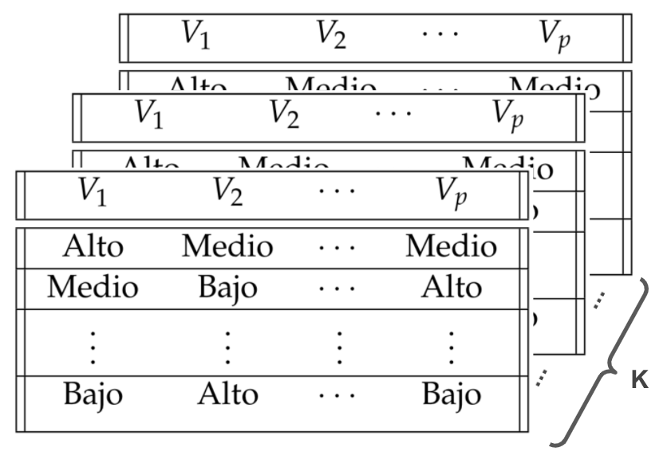
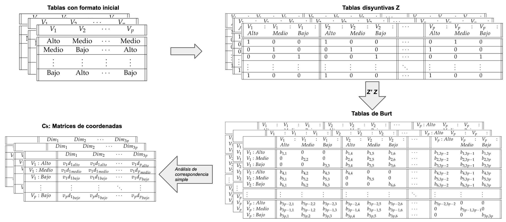
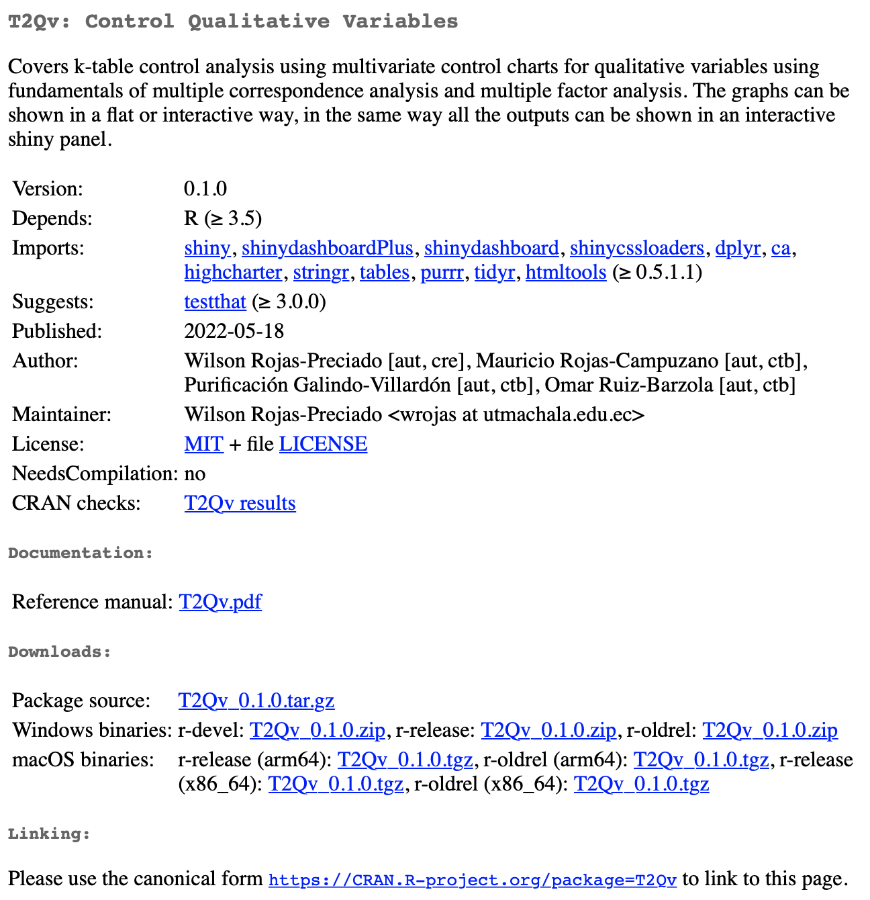
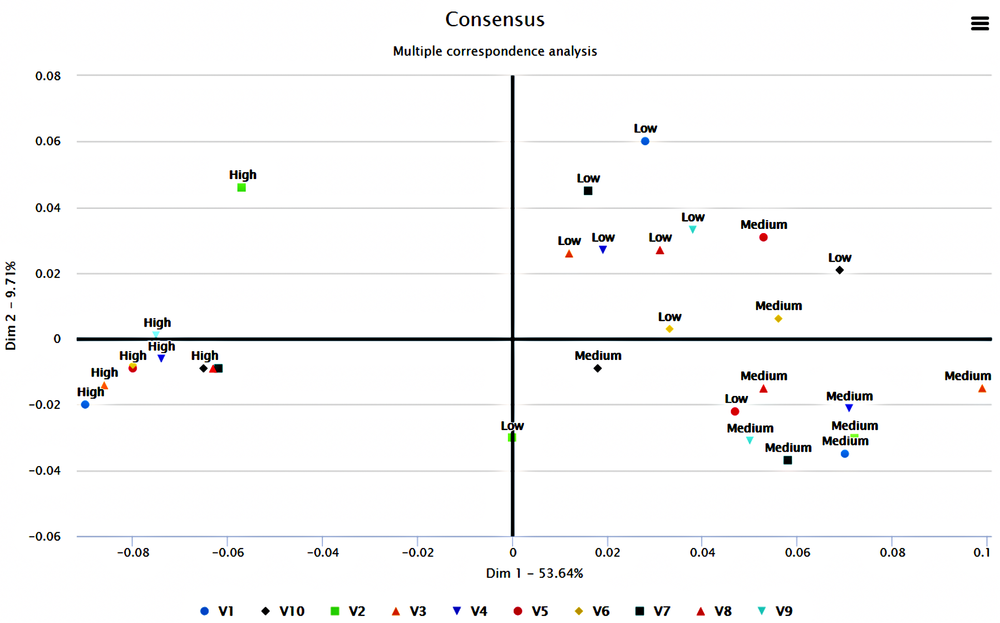
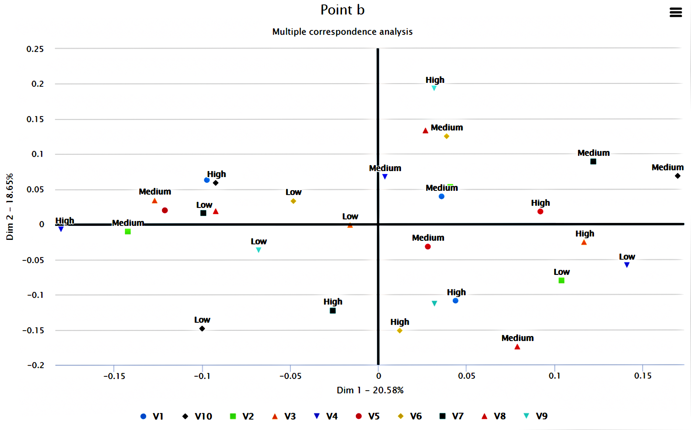
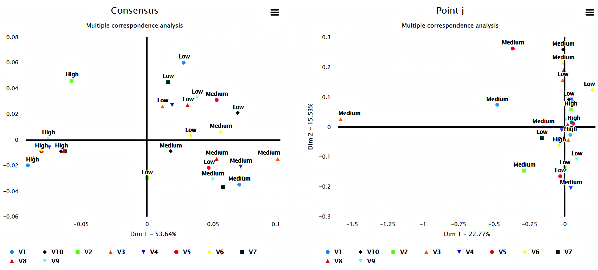
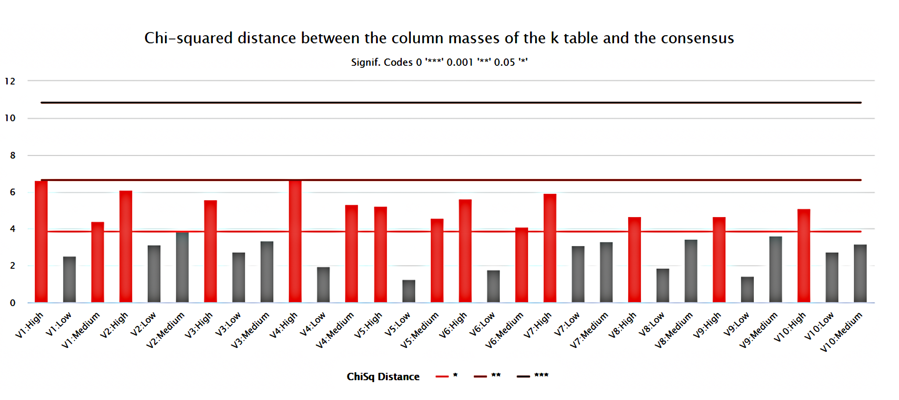
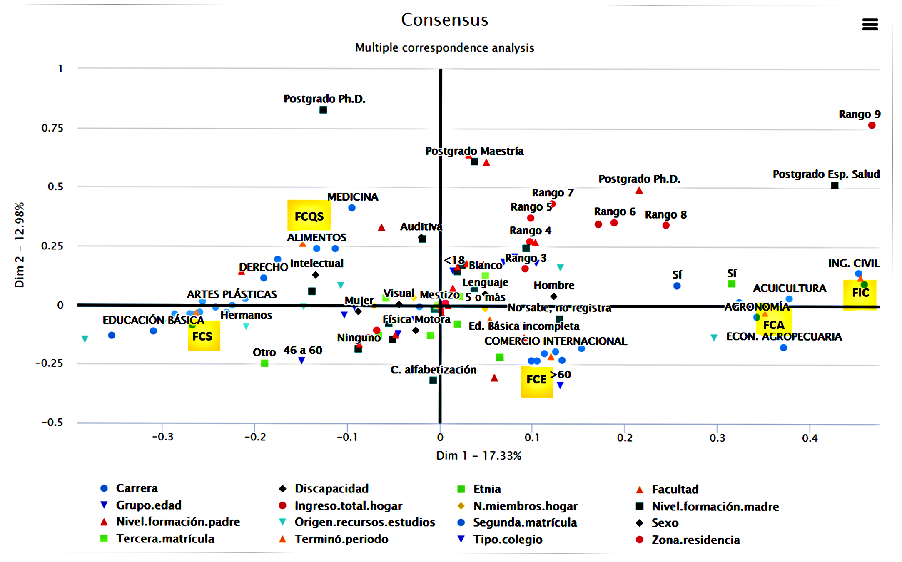
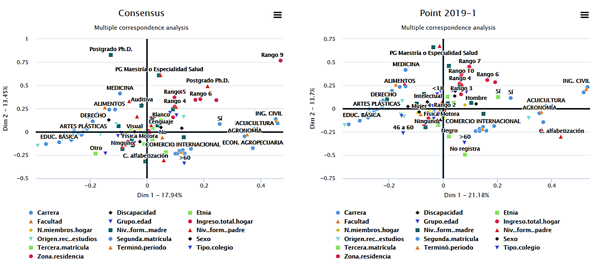
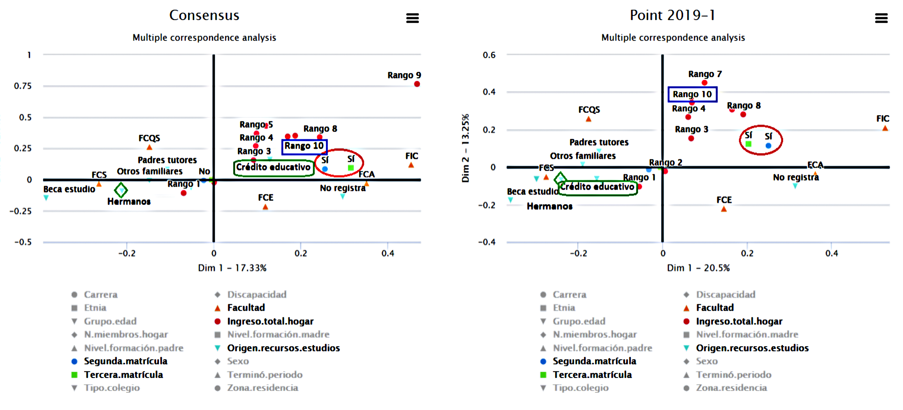

# Introduction

Los gráficos de control constituyen una de las herramientas más importantes para definir límites y parámetros óptimos de los procesos, así como para controlar la calidad de los productos mediante la reducción de la variabilidad. El uso de gráficos de control facilita la evaluación del comportamiento de las variables del proceso y contribuye al logro de los objetivos planificados.

La variación de los procesos se entiende como la diversidad de resultados que genera un grupo de variables de un proceso, su monitoreo es un objetivo clave del control estadístico, por lo tanto, es necesario entender los tipos y motivos de la variabilidad. Para ello es preciso registrar de manera sistemática y adecuada diferentes variables del proceso que se desea controlar, como las propiedades de los insumos, las condiciones de operación de los equipos, las competencias del personal que maneja los procesos, además de las características de los productos, la satisfacción de los usuarios, el cumplimiento de requisitos, entre otras. 

El pionero del control estadístico de procesos fue Walter Shewhart (SPC). Estableció las diferencias entre la variabilidad natural o común, presente en todos los procesos, y la provocada por causas asignables o especiales, que pueden llevarlos a un estado de fuera de control. Señaló que un proceso está en control estadístico cuando trabaja sólo con causas comunes de variación. Propuso los primeros gráficos de control para variables de tipo continuo y para variables de atributos [@Gutierrez2013]. 

El SPC mediante gráficos de control permitió a las organizaciones monitorear el comportamiento de una variable a la vez, no obstante, las organizaciones requirieron, con el pasar del tiempo, el análisis de varias características de calidad de forma simultánea, abriendo la puerta al SPC desde una perspectiva multivariante [@ramos2017]. Para facilitar el control de calidad de procesos es común el uso de gráficas de control que recolectan abundante información en diversas variables de forma simultánea, su análisis permite caracterizar los diferentes tipos de variables que afectan la calidad y explican su comportamiento a lo largo del tiempo [@li2012].

Hay una variedad de gráficos de control de procesos desde la perspectiva multivariante, entre los  clásicos están el Gráfico $T^2$ de Hotelling [@hotelling1947], el Multivariate Exponentially Weighted Moving – MEWMA [@lowry1992], el Multivariate Cumulative Sum Control Chart – MCUSUM [@Crosier1988]. Con el transcurso del tiempo se hicieron diversos aportes para mejorar el rendimiento de estos gráficos, entre los más destacados están Gráfico de control $T^2$ con tamaños de muestra adaptables [@Aparisi1996], Gráfico de control $T^2$ con intervalos de muestreo variables [@Aparisi2001], Gráfico de control $T^2$ con líneas de advertencia dobles [@Faraz2006], Gráfico de control robusto [@shabbak2012], Gráficos de control basados en modelos de minería de datos para procesos multivariantes y autocorrelacionados [@kim2012], Gráficos de control de calidad multivariantes con dimensión variable [@ruiz2013], Gráfico de control para el coeficiente de variación multivariante [@yeong2016].

Además de estos gráficos de control para entornos paramétricos, se desarrollaron otros para datos numéricos y cualitativos en entornos multivariantes no paramétricos, entre ellos el Gráfico de control multivariante basado en la distancia de Gower para una combinación de variables continuas y cualitativas [@Tuerhong2014], Gráfico de control multivariante basado en la combinación de PCA para características de calidad de atributos y variables [@Muhammad2018], Gráfico de control multivariante no paramétrico basado en la ponderación de novedad sensible a la densidad para procesos no normales [@liu2020], Gráfico de control de deméritos con clustering difuso de c-medias [@yilmaz2020], Gráfico de control basado en ACP que utiliza máquinas de vectores de soporte para distribuciones no normales multivariadas [@Farokhnia], Gráfico CUSUM no paramétrico para monitorear procesos multivariados correlacionados en serie [@xue2020], Gráfico de control multivariante basado en Kernel PCA para monitorear características de calidad de atributos y variables mixtas [@Ahsan2020], Gráfico $T^2$ basado en la combinación de PCA para datos continuos y cualitativos con detección de datos atípicos [@Ahsan2021].

Como se puede observar, la literatura científica es abundante en lo referente a gráficos de control en entornos multivariantes paramétricos y no paramétricos para datos numéricos y, en los últimos años, para datos mixtos (numéricos y cualitativos), sin embargo, son pocas las publicaciones sobre gráficos de control multivariantes para datos cualitativos. En este campo las propuestas se han desarrollado alrededor del análisis de variables que siguen una distribución Poisson y el análisis de variables multinomiales.

La primera propuesta fue la de @holgate1964, quien presentó un trabajo sobre la distribución Poisson bivariante para variables correlacionadas. Este modelo fue tomado como insumo en las investigaciones de autores como @chiu2007, @ho2009, @laungrungrong2011ewma, @epprecht2013optimal. Otra propuesta destacada es la de @lu1998control, quien desarrolló un gráfico de control tipo Shewhart para procesos multivariados con variables de atributos, cuando la característica de calidad asume valores binarios, que se denominó gráfico *np* multivariante (MNP). No obstante, hay escenarios en los que una clasificación dicotómica es insuficiente y se vuelve necesario acudir a niveles intermedios, en cuyo caso el análisis requiere el uso de distribuciones multinomiales. 

En este contexto @ranjan2008multivariate planteó un gráfico de control multivariante utilizando el estadístico $D^2$ de Mahalanobis para atributos que siguen una distribución multinomial. Además, surgieron los gráficos de control multivariantes en procesos multinomiales bajo el enfoque difuso [@taleb2006multivariate]; @taleb2009control introdujo gráficos de control para el monitoreo de procesos multivariados con datos lingüísticos multidimensionales, basados en dos procedimientos: la teoría de la probabilidad y la teoría difusa; @pastuizaca2015multivariate presentaron un gráfico de control multivariante multinomial T2 con un enfoque difuso.

Un aporte interesante es el de @epprecht2013optimal, quienes presentaron una combinación lineal óptima de variables discretas, cuando siguen la distribución de Poisson, para el SPC multivariantes. Asimismo, @raza2019design desarrollaron gráficos de control para datos con distribución Poisson multivariante utilizando un muestreo generalizado de estados dependientes múltiples (GMDS).


En el estudio de los procesos que se desarrollan en el entorno social-educativo y que explican el comportamiento de variables como el rendimiento académico, tasas de graduación o deserción, producción científica, porcentajes de matrícula de nuevo ingreso, entre otros, se maneja con mucha frecuencia variables cualitativas. No es que estén ausentes los datos cuantitativos, sino que, en las bases de datos que se utilizan para estos análisis, abundan las variables cualitativas nominales y ordinales sobre las de tipo numérico, algunos ejemplos de datos de los estudiantes son: sexo, lugar de procedencia, autodenominación étnica, grado académico de los padres, tipo de institución educativa de procedencia (fiscal, particular, municipal); ejemplos de datos de las instituciones son: tipo de sostenimiento económico, jornada, modalidad, campo de estudio, niveles (tecnológico, grado y postgrado), tipo de infraestructura; ejemplos asociados a datos de los profesores son: titularidad, dedicación, grado académico, grado en el escalafón, discapacidad, entre otros.

@perez2004 señala que al observar muchas variables sobre una muestra es presumible que una parte de la información recogida pueda ser redundante o que sea excesiva, en cuyo caso los métodos multivariantes de reducción de la dimensión tratan de eliminarla combinando muchas variables observadas para quedarse con pocas variables ficticias que, aunque no observadas, sean combinación de las reales y sinteticen la mayor parte de la información contenida en sus datos. En este caso se deberá tener en cuenta el tipo de variables que maneja. Si son variables cuantitativas las técnicas que le permiten este tratamiento pueden ser el Análisis de componentes principales  [@Person1901;@Hotelling1933], el Análisis factorial [@ch1904; @thurstone1947; @kaiser1958], mientras que, si se trata de variables cualitativas, es recomendable la aplicación de un Análisis de correspondencias múltiple, Análisis de homogeneidad o un Análisis de Escalamiento multidimensional.    

En el contexto del SPC el análisis gráficos de control para variables cualitativas todavía es incipiente. Al analizar los procedimientos publicados por los autores citados en este estudio, se detecta limitaciones que podrían restringir su aplicación, por ejemplo, el análisis de pocas características de la calidad, el uso de muestras constituidas por elementos individuales en vez de grupos, la dificultad de trabajar con muchas categorías de forma simultánea. Surge, entonces, la necesidad de un gráfico de control para la representación de p variables cualitativas, que pueda trabajar con múltiples categorías nominales y ordinales y que facilite la identificación de las causas que pueden llevar al proceso a un estado fuera de control.     

Esta necesidad se atiende en esta investigación, cuyo objetivo es desarrollar un gráfico de control para variables cualitativas con múltiples categorías nominales y ordinales, mediante la aplicación de una metodología de análisis multivariante, para que se contribuya a la diversificación de técnicas en la fase I del control estadístico de procesos.     


Este artículo está organizado de la siguiente manera: la Introducción, que establece los antecedentes conceptuales y referenciales de los gráficos de control multivariantes aplicados a variables cualitativas; la sección 2, materiales y métodos, que detalla el procedimiento que se siguió en el desarrollo del gráfico de control propuesto; la sección 3 describe al complemento computacional que facilita la aplicación de esta metodología; la sección 4 muestra los resultados mediante el análisis de datos simulados y datos reales aplicados al contexto de la educación superior; la sección 5 corresponde al análisis de sensibilidad que relaciona el número de dimensiones analizadas versus la confiabilidad de los resultados. La sección 6 presenta la discusión mediante un análisis comparativo entre el gráfico de control T2Qv y las propuestas de otros autores. Finalmente, la sección 7 establece las conclusiones.      

# Metodología

## Notación

La tabla \ref{tab:notacion} contiene elementos, representación y ejemplos de la manera como se presentan los elementos algebraicos abordados en la metodología.

\begin{table}[!ht]
\begin{center}
 \begin{tabular}{||c ||c |c ||} 
 \hline
 Elementos & Representación & Ejemplo \\
 \hline\hline
 Escalares & Letras en minúscula. & $v,\lambda$\\
\hline
Vectores & Letras en minúscula y en negrita. & $\mathbf{v},\mathbf{u}$\\
\hline
Matrices & Letras en mayúscula y en negrita. & $\mathbf{V},\mathbf{X}$\\
\hline
Matrices de tres vías (Cubos de datos) & Letras con doble trazo en mayúscula. & $\mathbb{C},\mathbb{X}$\\
\hline
\end{tabular}\caption{Elementos algebraicos}
\label{tab:notacion}
\end{center}
\end{table}

A lo largo del artículo se utilizarán letras para hacer referencia a parámetros necesarios, se los enuncia a continuación en la tabla \ref{tab:notacion2}:

\begin{table}[!ht]
\begin{center}
 \begin{tabular}{||c ||c | c ||} 
 \hline
 Letra &  Significado & Especificación\\
 \hline\hline
 $p$ & Número de dimensiones &\\
\hline
 $K$ & Número total de tablas (Especifica la profundidad del cubo de datos) & \\
 \hline
 $k$ & Índice de tabla &  k=1,2,...,K\\
  \hline
 $T$ & Índice de matriz transpuesta &  $\mathbf{X^{T}}$\\
\hline
 $n$ & Tamaño muestral de las $k$ tablas &\\
\hline
\end{tabular}\caption{Notación}
\label{tab:notacion2}
\end{center}
\end{table}

## Bases metodológicas

### Análisis de Correspondencias Simple

El tratamiento multivariante de variables cualitativas requiere un proceso metodológico distinto, uno de los más representativos es el Análisis de Correspondencias [@Benzecri]. Según [@perez2004], este análisis implica estudios de similaridad o disimilaridad entre categorías, se debe cuantificar la diferencia o distancia entre ellas sumando las diferencias cuadráticas relativas entre las frecuencias de las distribuciones de las variables analizadas, lo que conduce al concepto de la $\chi^2$.  Así, el análisis de correspondencias puede considerase como un análisis de componentes principales aplicado a variables cualitativas que, al no poder utilizar correlaciones, se basa en la distancia no euclídea de la$\chi^2$.      

En el enfoque francés del análisis de correspondencias, que se caracteriza por el énfasis en la geometría, el análisis de una tabla cruzada se llama análisis de correspondencias (CA) y el análisis de una colección de matrices indicadoras, se denomina análisis de correspondencias múltiples (MCA) [@michailidis1998]. En contextos anglosajones, el MCA es conocido como Análisis de Homogeneidad o Escalamiento Dual, especialmente en psicometría.


### Análisis de Correspondencias Múltiples (MCA)

El análisis de correspondencias múltiples (MCA) es una generalización del análisis de correspondencias simple o binario, donde se incluyen más variables cualitativas. Se obtiene al realizar el análisis de correspondencias simple a una tabla disyuntiva completa, conocida como la tabla de Burt.    

Se tiene una matriz de datos con $p$ variables cualitativas, cada una con $h$ categorías ($h$ >1). En el ejemplo que se desarrolla para esta investigación, se dispone de una base de datos  (*Datak10Contaminated*) constituida por 10 tablas, cada una tiene 10 variables y cada variable, 3 categorías (Alto, Medio y Bajo).

\begin{table}[!ht]
\begin{center}
 \begin{tabular}{||c c c c||} 
 \hline
 $V_{1}$ & $V_{2}$ & $\cdots$ & $V_{p}$ \\ [0.5ex] 
 \hline\hline
 Alto & Medio & $\cdots$ & Medio\\
 \hline
Medio & Bajo & $\cdots$ & Alto\\
\hline
\vdots & $\vdots$ & $\vdots$ & $\vdots$\\
\hline
Bajo & Alto & $\cdots$ & Bajo \\ [1ex] 
 \hline
\end{tabular}\caption{Matriz inicial}
\label{tab:inicial}
\end{center}
\end{table}

Esta matriz es equivalente a la matriz disyuntiva $Z$, que desglosa las variables en cada una de sus modalidades y se registra la ocurrencia de eventos de forma binaria.
\begin{table}[!ht]
\begin{center}
 \begin{tabular}{||p{1cm}p{1cm}p{1cm}||p{1cm}p{1cm} p{1cm} ||p{1cm} ||p{1cm} p{1cm} p{1cm} ||} 
 \hline
 $V_{1}:Alto$ &$V_{1}:Medio$ &$V_{1}:Bajo$ & $V_{2}:Alto$ & $V_{2}:Medio$ & $V_{2}:Bajo$ & $\cdots$ & $V_{p}:Alto$ & $V_{p}:Medio$ & $V_{p}:Bajo$ \\ [0.5ex] 
 \hline\hline
 1 & 0 & 0 & 1 & 0 & 0 & $\cdots$ & 0 & 1 & 0 \\ [0.2ex] 
 \hline
 0 & 1 & 0 & 0 & 1 & 0 & $\cdots$ & 1 & 0 & 0 \\ 
\hline
 0 & 0 & 1 & 0 & 0 &  1 & $\cdots$ & 0 & 0 & 1 \\ 
\hline
 $\vdots$ & $\vdots$ & $\vdots$ & $\vdots$ & $\vdots$ &  $\vdots$ & $\ddots$ & $\vdots$ & $\vdots$ & $\vdots$ \\ 
\hline
 1 & 0 & 0 & 1 & 0 & 0 & $\cdots$ &1 & 0 & 0 \\  
 \hline
\end{tabular}
\caption{Matriz disyuntiva Z}
\label{tab:z}
\end{center}
\end{table}

La tabla de Burt viene dada por: 

\begin{equation}
\mathbf{B}=\mathbf{Z'}\mathbf{Z}
\label{eq:Burt}
\end{equation}

La construcción de la matriz de Burt se da por la superposición de tablas. En las tablas ubicadas en la diagonal se encuentran matrices diagonales que contienen las frecuencias marginales de cada una de las variables. Fuera de la diagonal de la matriz de Burt se encuentran las tablas cruzadas por pares de variables.        
Para realizar el análisis de correspondencias múltiples se parte de la matriz de Burt, obtenida con la ecuación \ref{eq:Burt}. Esta matriz está formada por las frecuencias absolutas, éstas se transforman en frecuencias relativas, dividiendo los valores de la matriz por la frecuencia total, dando lugar a una nueva matriz que se denominará **P**.

\begin{table}[!ht]
\begin{center}
 \begin{tabular}{| p{1.7cm} ||p{1cm}p{1cm}p{1cm}||p{1cm}p{1cm} p{1cm} ||p{1cm} ||p{1.3cm} p{1cm} p{1cm} ||} 
 \hline
  & $V_{1}:Alto$ &$V_{1}:Medio$ &$V_{1}:Bajo$ & $V_{2}:Alto$ & $V_{2}:Medio$ & $V_{2}:Bajo$ & $\cdots$ & $V_{p}:Alto$ & $V_{p}:Medio$ & $V_{p}:Bajo$ \\ [0.5ex] 
 \hline\hline
 $V_{1}:Alto$ & $b_{1,1}$ & 0 & 0  & $b_{1,4}$ & $b_{1,5}$ & $b_{1,6}$ & $\cdots$ & $b_{1,3p-2}$ & $b_{1,3p-1}$ & $b_{1,3p}$ \\
 $V_{1}:Medio$ & 0 & $b_{2,2}$ & 0 & $b_{2,4}$ & $b_{2,5}$ & $b_{2,6}$ & $\cdots$ & $b_{2,3p-2}$ & $b_{2,3p-1}$ & $b_{2,3p}$ \\ 
 $V_{1}:Bajo$ & 0 & 0 & $b_{3,3}$  & $b_{3,4}$ & $b_{3,5}$ & $b_{3,6}$ & $\cdots$ & $b_{3,3p-2}$ & $b_{3,3p-1}$ & $b_{3,3p}$ \\ 
\hline\hline
  $V_{2}:Alto$ & $b_{4,1}$ & $b_{4,2}$ & $b_{4,3}$ & $b_{4,4}$ & 0 & 0 & $\cdots$ & $b_{4,3p-2}$ & $b_{4,3p-1}$ & $b_{4,3p}$ \\
 $V_{2}:Medio$ & $b_{5,1}$ & $b_{5,2}$ & $b_{5,3}$ & 0 & $b_{5,5}$ & 0 & $\cdots$ & $b_{5,3p-2}$ & $b_{5,3p-1}$ & $b_{5,3p}$ \\ 
 $V_{2}:Bajo$ &  $b_{6,1}$ & $b_{6,2}$ & $b_{6,3}$ & 0 & 0 &  $b_{6,6}$ & $\cdots$& $b_{6,3p-2}$ & $b_{6,3p-1}$ & $b_{6,3p}$ \\ 
\hline\hline
 
 $\vdots$ & $\vdots$ & $\vdots$ & $\vdots$ & $\vdots$ & $\vdots$ & $\vdots$ & $\ddots$ & $\vdots$ & $\vdots$ & $\vdots$ \\ 
 
\hline\hline
 $V_{p}:Alto$  & $b_{3p-2,1}$   & $b_{3p-2,2}$   & $b_{3p-2,3}$   & $b_{3p-2,4}$   & $b_{3p-2,5}$   & $b_{3p-2,6}$    & $\cdots$ & $b_{3p-2,3p-2}$ & 0 & 0 \\
 $V_{p}:Medio$ & $b_{3p-1,1}$ & $b_{3p-1,2}$ & $b_{3p-1,3}$ & $b_{3p-1,4}$ & $b_{3p-1,5}$ & $b_{3p-1,6}$  & $\cdots$ & 0 & $b_{3p-1,3p-1}$ & 0 \\ 
 $V_{p}:Bajo$  & $b_{3p,1}$ & $b_{3p,2}$ & $b_{3p,3}$ & $b_{3p,4}$ & $b_{3p,5}$ & $b_{3p,6}$  & $\cdots$ & 0 & 0 & $b_{3p,3p}$ \\ 
\hline
\end{tabular}
\caption{P: Tabla de contingencia de Burt en frecuencias relativas}
\label{tab:p}
\end{center}
\end{table}


Se obtienen las marginales de las filas *(mf)* y de las columnas *(mc)* de la matriz **P** (Tabla \ref{tab:p}). A estos vectores se los conoce también como *Masas de fila y columna*, respectivamente.

\begin{table}[!ht]
\begin{center}
 \begin{tabular}{||p{1cm}p{1cm}p{1cm}||p{1cm}p{1cm} p{1cm} ||p{1cm} ||p{1cm} p{1cm} p{1cm} ||} 
 \hline
 $V_{1}:Alto$ &$V_{1}:Medio$ &$V_{1}:Bajo$ & $V_{2}:Alto$ & $V_{2}:Medio$ & $V_{2}:Bajo$ & $\cdots$ & $V_{p}:Alto$ & $V_{p}:Medio$ & $V_{p}:Bajo$ \\ [0.5ex] 
 \hline
    $b_{\bullet,1}$ & $b_{\bullet,2}$ & $b_{\bullet,3}$ & $b_{\bullet,4}$ & $b_{\bullet,5}$ & $b_{\bullet,6}$ & $\cdots$ & $b_{\bullet,3p-2}$ & $b_{\bullet,3p-1}$ & $b_{\bullet,3p}$ \\ [0.5ex] 
 \hline
\end{tabular}
\caption{Frecuencias marginales de las filas. (mf)}
\label{tab:margfilas}
\end{center}
\end{table}

\begin{table}[h!]
\begin{center}
 \begin{tabular}{||p{1cm}p{1cm}p{1cm}||p{1cm}p{1cm} p{1cm} ||p{1cm} ||p{1cm} p{1cm} p{1cm} ||} 
 \hline
 $V_{1}:Alto$ &$V_{1}:Medio$ &$V_{1}:Bajo$ & $V_{2}:Alto$ & $V_{2}:Medio$ & $V_{2}:Bajo$ & $\cdots$ & $V_{p}:Alto$ & $V_{p}:Medio$ & $V_{p}:Bajo$ \\ [0.5ex] 
 \hline
    $b_{\bullet,1}$ & $b_{\bullet,2}$ & $b_{\bullet,3}$ & $b_{\bullet,4}$ & $b_{\bullet,5}$ & $b_{\bullet,6}$ & $\cdots$ & $b_{\bullet,3p-2}$ & $b_{\bullet,3p-1}$ & $b_{\bullet,3p}$ \\ [0.5ex] 
 \hline
\end{tabular}
\caption{Frecuencias marginales de las columnas. (mc)}
\label{tab:margcolumnas}
\end{center}
\end{table}


Se obtiene la matriz de residuos estandarizados **S**.

\begin{equation}
\mathbf{S}=\mathbf{D_{fila}}^{-\frac{1}{2}}(\mathbf{P}-\mathbf{mf} \hspace{0.2cm} \mathbf{mc'})\mathbf{D_{columna}}^{-\frac{1}{2}}
\label{eq:s}
\end{equation}
donde:    

- $\mathbf{D_{fila}}$ es una matriz diagonal que contiene las masas de las filas.    
- $\mathbf{D_{columna}}$ es una matriz diagonal que contiene las masas de las columnas    

Se aplica descomposición singular (SVD) a la matriz **S** (Ecuación \ref{eq:s}):

\begin{equation}
\mathbf{S}=\mathbf{U}\mathbf{D}\mathbf{V'}
\label{eq:svd}
\end{equation}
donde:    

- $\mathbf{U}$ y $\mathbf{V}$ son matrices ortogonales.    
- $\mathbf{D}$ es una matriz diagonal que contiene los valores singulares. 


Para encontrar las coordenadas estandarizadas se aplica lo siguiente:

\begin{equation}
\mathbf{X}=\mathbf{D_{fila}}^{-\frac{1}{2}} \mathbf{U}
\label{eq:xcoor}
\end{equation}

\begin{equation}
\mathbf{Y}=\mathbf{D_{columna}}^{-\frac{1}{2}} \mathbf{V}
\label{eq:ycoor}
\end{equation}

Para los fines necesarios, se utilizará las coordenadas de las columnas (Tabla \ref{tab:colcoor}).

\begin{table}[!ht]
\begin{center}
 \begin{tabular}{|| c ||c c c c||} 
 \hline
 & $Dim_{1}$      & $Dim_{2}$ & $\cdots$ & $Dim_{3p}$ \\ [0.5ex] 
 \hline\hline
  $V_{1}:Alto$    & ${v_{1}d_{1}}_{alto}$& ${v_{1}d_{1}}_{alto}$  & $\cdots$ & ${v_{1}d_{p}}_{alto}$\\
 \hline
 $V_{1}:Medio$    &${v_{1}d_{1}}_{medio}$ & ${v_{1}d_{1}}_{medio}$ & $\cdots$ & ${v_{1}d_{p}}_{medio}$\\
\hline
 $V_{1}:Bajo$     &${v_{1}d_{1}}_{bajo}$ & ${v_{1}d_{1}}_{bajo}$  &$\cdots$ & ${v_{1}d_{p}}_{bajo}$\\
\hline
\vdots & $\vdots$ & $\vdots$  &$\ddots$& $\vdots$\\
\hline
 $V_{p}:Bajo$     &${v_{p}d_{1}}_{bajo}$ & ${v_{p}d_{1}}_{bajo}$ & $\cdots$ & ${v_{p} d_{p}} _{bajo}$ \\ [1ex] 
 \hline
\end{tabular}\caption{Coordenadas estandarizadas de las columnas.}
\label{tab:colcoor}
\end{center}
\end{table}

### Análisis de Homogeneidad

El Análisis de Homogeneidad, Homogeneous Alternating Least Squares (HOMALS), es un modelo de la familia de modelos matemáticos del Escalamiento óptimo del sistema Gifi [@Gifi1990], el cual comprende una serie de técnicas exploratorias de análisis multivariado no lineal. Igual que el MCA, HOMALS se considera una forma de Análisis de Componentes Principales para datos cualitativos. El Análisis de Homogeneidad representa los objetos analizados mediante puntos en el modelo espacial, sus características más relevantes se presentan en las relaciones geométricas entre los puntos, para ello, es necesario la cuantificación de datos cualitativos [@Lopez2014].      
El uso de variables cualitativas no es particularmente restrictivo, ya que una variable numérica continua se puede considerar como una variable cualitativa con un gran número de categorías. HOMALS se diferencia del el MCA en que éste utiliza la función de Descomposición de valores propios mientras que el Análisis de Homogeneidad utiliza Mínimos Cuadrados Alternos, lo que se conoce en la literatura como la Solución de Homals [@michailidis1998]. 


### Generalización a $k$ tablas

Si se tienen *k* tablas, con la misma estructura de la tabla \ref{tab:inicial}, como se visualiza en la figura \ref{fig:ktables}, se aborda el enfoque del análisis factorial múltiple (MFA). @AFM indica que el MFA utiliza análisis de correspondencias múltiples cuando se trata de variables cualitativas. El procedimiento implica la realización de un MCA por cada tabla y dividirlo por su primer valor propio con la finalidad de obtener $K$ grupos normalizados. Posteriormente se consideran todas las tablas y se realiza un MCA global.

\begin{figure}[!ht]


```{r diagram, echo=FALSE, fig.align='center',results='asis', fig.pos="H", out.extra = "", out.width='40%', fig.width=16, fig.height=9}

```

\caption{$k$ tablas con el formato inicial.}

\label{fig:ktables}
\end{figure}

La generalización a *k* tablas del procedimiento del MCA, se presenta en la Figura \ref{fig:MCAk}


\begin{figure}[!h]

```{r , echo=FALSE, fig.align='center',results='asis', fig.pos="h", out.extra = "", out.width='90%', fig.width=16, fig.height=9}

```

\caption{Procedimiento del MCA para $k$ tablas}

\label{fig:MCAk}
\end{figure}

Se llama $C$ a cada tabla de coordenadas. Con la finalidad de detectar la magnitud de las variables latentes, su aporte neto a las variables, se trata la matriz $C$ con valor absoluto.

### Aporte del Análisis Factorial Múltiple (MFA)

Una vez que se tienen las coordenadas de las columnas, se procede a realizar la normalización, característica del procedimiento MFA.

Sea $\lambda_{1}^{k}$ el primer valor propio obtenido de la descomposición singular de la k-ésima tabla C. Se normaliza la tabla multiplicándola por $1/\lambda_{1}^{k}$. Con esto se obtiene la tabla $C^{'}$, que corresponde a la tabla de coordenadas normalizadas.    
Individualmente, para el caso de la matriz k, se tendría la siguiente expresión.

\begin{equation}
\mathbf{C'_k}=\frac{1}{\lambda_{k}^1} \mathbf{C_k}
\label{eq:Cprimak}
\end{equation}

Aglomerando las matrices normalizadas $C^{'}$ en una sola, se tiene la matriz $\mathbb{C}^{'}$. Esta contiene todos los elementos de las *k* tablas.

\begin{equation}
\mathbf{\mathbb{C^{'}}}=[\mathbf{C_1^{'}}|\mathbf{C_2^{'}}|,...,|\mathbf{C'_{K}}]^{T}
\label{eq:Cprima}
\end{equation}

La normalización que realiza el MFA se encarga de ponderar las *k* tablas, con el objetivo de evitar alguna descompensación al momento de realizar el análisis conjunto de las tablas. 

## Gráfico de control T2Qv

### Obtención del gráfico de control

Para definir el gráfico de control $T^2$ Hotelling se deben tomar las siguientes consideraciones:

- La tabla $\mathbb{C}^{'}$ (Ecuación \ref{eq:Cprima}) se denomina Consenso, sirve como referente para el escenario *bajo control*, y de la cual se obtiene $\mu_{0}$ y $\mathbf{S_0}$.  
- Cada matriz $\mathbf{C'_k}$ tiene el mismo número de filas (n) y columnas (p) (individuos y variables).
- El vector de medias $\mathbf{\mu_k}$ está atado a la tabla $\mathbf{C'_k}$, es decir, el gráfico de control estará en función de las diferencias entre las matrices $\mathbf{C'_k}$ y la matriz consenso $\mathbf{\mathbb{C^{'}}}$.
- Las matrices $\mathbf{C'_k}$ siguen una distribución normal multivariante con vector de medias $\mu_{k}$ y matriz de covarianzas $\mathbf{S_k}$.


Con esto se obtiene el estadístico $T^2$:

\begin{equation}
T^2=n (\mu_{k}-\mu_{0})'\mathbf{\Sigma_{0}^{-1}}(\mu_{k}-\mu_{0})
\label{eq:T2}
\end{equation}

Se sabe que, bajo control, el $T^2$ se distribuye como una Chi-cuadrado con $p$ grados de libertad $\chi^2_p$. En este caso se puede aplicar este principio, ya que se utiliza la matriz consenso 
($\mathbb{C}^{'}$), que representa al escenario bajo control. 

Dado que este gráfico de control está basado en distancias de Mahalanobis ponderadas, sólo tiene límite de control superior. Este viene dado por la ecuación \ref{eq:UCL}

\begin{equation}
UCL=\chi^2_{\alpha^{'},p}
\label{eq:UCL}
\end{equation}

donde $p$ es el número de dimensiones y $\alpha^{'}$ es la significancia predeterminada considerando $p$. Tal que $\alpha^{'}=1-(1-\alpha)^{p}$ y $\alpha$, que en este estudio se considera como el error tipo 1 inicial, generalmente es igual a 0.0027.       

Para definir $\alpha^{'}$ (Error tipo 1) se opta el enfoque múltiple, @montgomery2012statistical indica que con este enfoque se consigue una variación de $\alpha^{'}$ en función de $p$, esto es conveniente en este caso ya que permite considerar la dimensionalidad usada al realizar el análisis de correspondencias múltiples.


### Interpretación de puntos fuera de control

El gráfico multivariante $T^2$ de Hotelling para variables cualitativas es capaz de señalar que el proceso salió de control, pero no permite reconocer el momento ni las causas por las que ocurrió esto. Es obvio que, más allá de reconocer el estado del proceso, interesa saber cuándo y por qué salió de control. Es importante tener en cuenta que cada punto representado en el gráfico $T^2$ de Hotelling representa a una tabla (muestra), constituida por un grupo de individuos (observaciones) y p variables que pueden tener muchas categorías, algunas de éstas pueden mostrar un comportamiento anómalo. Por consiguiente, es necesario analizar con detenimiento que está pasando con los datos de las tablas reportadas. 

Este análisis se realiza comparando la ubicación de los puntos que representan las categorías de las variables en el MCA de la tabla consenso y la ubicación de los puntos en los gráficos MCA de cada tabla reportada como fuera de control. Las categorías que están incidiendo en el estado fuera de control son aquellas cuya ubicación en ambas tablas comparadas muestra diferencias importantes. Para cuantificar la magnitud del comportamiento anómalo de estas categorías se calcula las distancias Chi-cuadrado entre las masas de las columnas de la tabla reportada como fuera de control y las de la tabla consenso, tomada como referente. Mientras mayor es el valor del estadístico, mayor es su incidencia en el desplazamiento de la media del proceso que, finalmente, pueden llevarlo a un estado fuera de control. 

El aplicativo informático del gráfico T2Qv presenta esta información de dos maneras: la primera es una tabla que registra las distancias $\chi^2$ para cada categoría de las variables analizadas, además, muestra el *p*-valor para cada observación, de esto depende el número de asteriscos que indican su nivel de significancia estadística. Así, si el *p*-valor es inferior a 0.05, la observación se reporta como significancia estadística y va asociada a un asterisco; si el *p*-valor es menor que 0.01, se entiende que hay alta significación estadística y se registran dos asteriscos; si el *p*-valor es menor que 0.001, la significancia estadística es muy alta y se reportan tres asteriscos; caso contrario, no se reporta significancia y la observación no lleva asteriscos.

La segunda manera consiste en un gráfico de barras que incluye tres líneas horizontales correspondientes a los límites asociados a los niveles de significancia estadística, la más baja representa al *p*-valor inferior a 0.05 (un asterisco); la línea del medio, al *p*-valor inferior a 0.01 (dos asteriscos); y, la línea más alta representa al p-valor inferior a 0.001 (tres asteriscos). Las barras que representan valores sin significancia estadística no sobrepasan ninguna de las líneas y se pintan de color gris, mientras que, las que sí denotan significancia estadística adquieren el color de la línea más alta que sobrepasan.

De esta manera, la metodología propuesta en esta investigación permite explicar cuándo y por qué el proceso salió de control.


# Complemento computacional

Para facilitar la difusión y aplicación del método propuesto, se ha desarrollado un paquete reproducible en R. El paquete **T2Qv** utiliza la metodología expuesta en este artículo y la lleva a un entorno práctico, permite visualizar los resultados de forma plana o interactiva, además, presenta un panel Shiny que contiene todas las funciones individuales en un mismo espacio.

## Disponibilidad

El paquete está disponible en GitHub, la descarga se la puede realizar de la siguiente forma:

```
install.packages("devtools")
devtools::install_github("JavierRojasC/T2Qv")
```

## El paquete: T2Qv

\begin{figure}[!ht]


```{r , echo=FALSE, fig.align='center',results='asis', fig.pos="H", out.extra = "", out.width='60%', fig.width=16, fig.height=9}

```

\caption{Documentación del paquete T2Qv}

\label{fig:documentation}
\end{figure}

Las funciones que contiene el paquete y su descripción se enuncian en la tabla \ref{tab:functions}.

\begin{table}[!ht]
\begin{center}
 \begin{tabular}{||c  m{35em}||} 
 \hline
  Función & Descripción \\ [0.5ex] 
 \hline\hline
 T2 qualitative & Multivariate control chart T2 Hotelling applicable for qualitative variables.\\
 \hline
  MCAconsensus & Multiple correspondence analysis applied to a consensus table.\\
\hline
  MCApoint & Multiple correspondence analysis applied to a specific table.\\
\hline
  ChiSq variable & Contains Chi square distance between the column masses of the table specified in PointTable and the consensus table. It allows to identify which mode is responsible for the anomaly in the table in which it is located. \\ [1ex] 
  \hline
  Full Panel & A shiny panel complete with the 
  multivariate control chart for 
  qualitative variables, the two MCA 
  charts and the modality distance table. 
  Within the dashboard, arguments such as 
  type I error and dimensionality can be 
  modified. \\ [1ex] 
 \hline
\end{tabular}\caption{Funciones del paquete T2Qv}
\label{tab:functions}
\end{center}
\end{table}


# Resultados

Con la intención de probar la metodología propuesta en el gráfico de control $T^2$ de Hotelling para variables cualitativas, se hizo un análisis con datos simulados y otro con datos reales aplicados al contexto de la educación superior. Los resultados se obtienen de la aplicación del paquete T2Qv.

## Resultados con datos simulados

Para este estudio se generó una base de datos simulados, a la que se denominó *Datak10Contaminated*. Consta de 10 tablas, cada una de ellas está constituida por 100 filas (observaciones) y 11 columnas, de las cuales, las 10 primeras corresponden a las variables analizadas (V1, V2, …; V10) mientras que, la columna 11, denominada *GroupLetter*, contiene el factor de clasificación de los grupos. Para su identificación, las tablas han sido denominadas con las letras del alfabeto, desde la *a* hasta la *j*. La tabla *j* tiene una distribución distinta de la que tienen las otras nueve. Los datos se expresan en tres niveles: alto, medio y bajo. La tabla \ref{} presenta las 10 primeras filas de la base de datos *Datak10Contaminated*. 


\begin{table}[]
\tiny
\centering
\resizebox{13cm}{!} {
\begin{tabular}{@{}lllllllllll@{}}
\toprule
\textbf{V1}                  & \textbf{V2}                    & \textbf{V3}                  & \textbf{V4}                    & \textbf{V5}                  & \textbf{V6}                    & \textbf{V7}                    & \textbf{V8}                    & \textbf{V9}                    & \textbf{V10}                   & \textbf{GroupLetter}      \\ \midrule
Low      & Medium     & Medium                       & High                           & High                         & High                           & Low                            & Medium                         & Medium                         & Medium                         & a                         \\
Low                          & Low                            & High                         & Low                            & Medium                       & High                           & High                           & High                           & Low                            & High                           & a \\
High & Medium & High & Low    & High & Medium & Medium & High   & Medium & Low    & a                         \\
Medium                       & Medium                         & Low                          & High                           & Low                          & Medium                         & High                           & Low                            & Low                            & High                           & a \\
Low  & Low    & Low  & High   & Low  & High   & High   & High   & Medium & Medium & a                         \\
High                         & High                           & Medium                       & Low                            & High                         & Low                            & Medium                         & Medium                         & High                           & Low                            & a \\
High & High   & Low  & Low    & Low  & Medium & High   & Medium & Medium & High   & a                         \\
Medium                       & Medium                         & High                         & Medium                         & Medium                       & High                           & Medium                         & High                           & High                           & High                           & a \\
Low  & Low    & Low  & Medium & High & Medium & Low    & Medium & Low    & Low    & a                         \\
Medium                       & Medium                         & Medium                       & High                           & Low                          & Medium                         & High                           & Low                            & High                           & Medium                         & a \\ \bottomrule
\end{tabular}
}

\caption{Sección de la base de datos Datak10Contaminated.}

\label{tab:tabladatos}

\end{table}


Para facilitar análisis se creó un paquete al que se denominó *T2Qv*, herramienta diseñada en el software estadístico R y R Studio. T2Qv realiza el análisis de control de *k* tablas utilizando gráficos de control multivariantes para variables cualitativas, utilizando los fundamentos del análisis de correspondencias múltiples y el análisis de factores múltiples. Los gráficos se pueden mostrar de forma plana o interactiva, de la misma manera todas las salidas se pueden mostrar en un panel interactivo de Shiny.       
El primer resultado es el gráfico del Análisis de Correspondencias Múltiples (MCA) aplicado a la tabla consenso (Figura \ref{fig:CONS1}). Esta tabla ha sido tomada como referente, como escenario en control para el análisis posterior de las tablas que sean reportadas como puntos fuera de control en el gráfico $T^2$ de Hotelling.       
El MCA reporta una inercia total del 63.3%, la dimensión 1 representa al 53.6% de la información, mientras que la dimensión 2, al 9.7%. Los puntos del gráfico representan a las observaciones de cada una de las 10 variables en sus tres niveles: alto, medio y bajo. En esta figura, todas las observaciones que corresponden al nivel alto se ubican a la izquierda en el eje de las X; de las 10 observaciones correspondientes al nivel medio, 8 se situaron en el cuarto cuadrante y las dos restantes en el cuadrante 1, es decir, todas las observaciones de este nivel estuvieron a la derecha en el eje de las X. Finalmente, de los 10 puntos que representan al nivel bajo, 8 están ubicados en el cuadrante 1.


\begin{figure}[!ht]


```{r , echo=FALSE, fig.align='center',results='asis', fig.pos="H", out.extra = "", out.width='90%', fig.width=18, fig.height=11}

```

\caption{Análisis de correspondencias múltiples aplicado a la tabla consenso.}

\label{fig:CONS1}
\end{figure}

Otro resultado es el Análisis de Correspondencias Múltiples aplicado a una tabla específica. En este punto, uno de los argumentos que se debe tener en cuenta es la selección de la tabla de la que se realizará el análisis. 

\begin{figure}[!ht]


```{r , echo=FALSE, fig.align='center',results='asis', fig.pos="H", out.extra = "", out.width='90%', fig.width=16, fig.height=9}

```

\caption{Análisis de correspondencias múltiples aplicado a la tabla b.}

\label{fig:MCAb}
\end{figure}

La figura \ref{fig:MCAb} representa el gráfico del MCA de la tabla *b*. Este gráfico, en sus dos dimensiones, representa al 39.3% de la información. Es notorio que las observaciones en sus niveles alto, medio y bajo están distribuidas de forma aleatoria en todos los cuadrantes del del gráfico, no se puede precisar un patrón específico de agrupación. Esto mismo se puede decir de los puntos representados en cualquiera de las otras tablas, exceptuando la tabla *j*, que fue diseñada con una distribución diferente.    
No obstante, el uso del MCA de las figuras \ref{fig:MCAb} y \ref{fig:CONS1} todavía no permite detectar si el proceso está o no en control. La identificación de puntos fuera de control se puede realizar mediante la representación gráfica del estadístico $T^2$ de Hotelling, como se observa en la figura \ref{fig:hot1}. 

\begin{figure}[!ht]


```{r , echo=FALSE, fig.align='center',results='asis', fig.pos="H", out.extra = "", out.width='90%', fig.width=16, fig.height=9}

```

\caption{Gráfico de control multivariante T2 Hotelling aplicable a variables cualitativas.}

\label{fig:hot1}
\end{figure}

La figura \ref{fig:hot1} presenta un gráfico de control elaborado con el estadístico $T^2$ de Hotelling, aplicado a la detección de anomalías en cualquiera de las *k* tablas analizadas. Cada una de las tablas está  representada por los puntos en el gráfico. Se observa una línea horizontal que representa al límite de control superior (UCL). El límite de control inferior (LCL) es igual a cero.        
Dado que el análisis de sensibilidad determinó que este gráfico de control tiene un mejor rendimiento cuando trabaja con un número alto de dimensiones, se ha recomendado que este sea p-1, donde p es el número de dimensiones inicial, que es equivalente a la cantidad de variables de la base de datos, sin contar a la variable GroupLetter que sólo sirve como factor de clasificación de las tablas.    
Se observa que el punto que representa a la tabla *j* se ubica por encima del límite de control superior, lo que quiere decir que se lo ha identificado como un valor fuera de control. Por consiguiente, es necesario analizar con detenimiento qué está pasando con los datos de la tabla reportada, comparándolos con los de la tabla consenso, a fin de identificar las causas de la variación y tomar las acciones pertinentes. 
Para hacer un análisis del punto fuera de control se realiza un gráfico del MCA de la tabla *j* y se lo compara con el gráfico similar de la tabla consenso, como se presenta en la figura \ref{fig:conspoint}.

\begin{figure}[!ht]


```{r , echo=FALSE, fig.align='center',results='asis', fig.pos="H", out.extra = "", out.width='90%', fig.width=16, fig.height=9}

```

\caption{Comparación de los gráficos del MCA aplicado a la tabla consenso y la tabla j.}

\label{fig:conspoint}
\end{figure}

La figura \ref{fig:conspoint} presenta la distribución de las observaciones de las tablas consenso y *j* mediante gráficos del MCA. El gráfico de la tabla consenso, que sirve de referente en control, ya se analizó en la figura \ref{fig:CONS1}; el de la tabla *j* muestra una tendencia de los puntos que con valores medios a ubicarse al lado izquierdo, bastante alejados de los demás que confluyen hacia el centro del eje de las X. Especial atención merece la variable 3, que registra una observación para el nivel medio con el valor más alejado del grupo.     
Al comparar los gráficos es obvio que la distribución de los datos en la tabla *j* es diferente de las distribuciones de las demás tablas, y en especial, es diferente de la distribución de la tabla consenso, lo que explica por qué el punto *j* ha sido identificado como fuera de control.       
   
La tabla \ref{tab:chi} contiene los datos de cada una de las variables de la tabla *j* con sus tres niveles (alto, medio y bajo). La columna 3 muestra el p-valor para cada observación, de esto depende el número de asteriscos de la columna 4 que indica el nivel de significancia estadística.     


\begin{table}[!ht]
\tiny
\centering
\begin{tabular}{@{}llll@{}}
\toprule
\textbf{Variable} & \textbf{Chi-Squared} & \textbf{p-value} & \textbf{Signif} \\ \midrule
V1:High & 6.62953 & 0.01003 & * \\
V1:Low & 2.51447 & 0.11281 &  \\
V1:Medium & 4.40573 & 0.03582 & * \\
V2:High & 6.10216 & 0.01350 & * \\
V2:Low & 3.15682 & 0.07561 &  \\
V2:Medium & 3.81899 & 0.05067 &  \\
V3:High & 5.58957 & 0.01807 & * \\
V3:Low & 2.73051 & 0.09845 &  \\
V3:Medium & 3.37596 & 0.06615 &  \\
V4:High & 6.61362 & 0.01012 & * \\
V4:Low & 1.95916 & 0.16160 &  \\
V4:Medium & 5.33225 & 0.02093 & * \\
V5:High & 5.23785 & 0.02210 & * \\
V5:Low & 1.24566 & 0.26438 &  \\
V5:Medium & 4.56461 & 0.03264 & * \\
V6:High & 5.64217 & 0.01753 & * \\
V6:Low & 1.81050 & 0.17845 &  \\
V6:Medium & 4.11597 & 0.04248 & * \\
V7:High & 5.94284 & 0.01478 & * \\
V7:Low & 3.10801 & 0.07791 &  \\
V7:Medium & 3.32453 & 0.06825 &  \\
V8:High & 4.65021 & 0.03105 & * \\
V8:Low & 1.88624 & 0.16963 &  \\
V8:Medium & 3.45642 & 0.06301 &  \\
V9:High & 4.67660 & 0.03058 & * \\
V9:Low & 1.46059 & 0.22684 &  \\
V9:Medium & 3.60793 & 0.05750 &  \\
V10:High & 5.10688 & 0.02383 & * \\
V10:Low & 2.76592 & 0.09629 &  \\
V10:Medium & 3.19604 & 0.07382 & 
\end{tabular}

\caption{Distancia $\chi^2$ entre las masas de la tabla consenso y las $k$, Datak10Contaminated}

\label{tab:chi}
\end{table}


De las 30 observaciones que tiene la tabla *j*, se presentan 14 casos de p-valores menores que 0.05, es decir, reportan significancia estadística (un asterisco), de los cuales, 10 se atribuyen a las categorías altas de las variables cualitativas y cuatro a los niveles medios. El comportamiento de estas variables en la tabla *j*, que obedece a una distribución diferente a la de las demás tablas, provoca el desplazamiento de la media del proceso que, al final, lo lleva a un estado fuera de control. 
Otra manera de visualizar esta información es a través de un gráfico de barras (figura \ref{fig:chibar}).

\begin{figure}[!ht]


```{r , echo=FALSE, fig.align='center',results='asis', fig.pos="H", out.extra = "", out.width='90%', fig.width=16, fig.height=9}

```

\caption{Distancia $\chi^2$ entre las masas de la tabla consenso y las $k$ tablas, Datak10Contaminated.}

\label{fig:chibar}
\end{figure}

El gráfico de barras de la figura \ref{fig:chibar}, expresa también la distancia $\chi^2$ entre las masas de la tabla consenso y las *k* tablas de la base de datos *Datak10Contaminated*. Es otra manera de representar la información que ya se analizó en la tabla \ref{tab:chi}.

## Resultados con datos aplicados al contexto de la educación superior


En este ejemplo se utiliza una base de datos denominada *Estudiantes_2019_2020*, tomada de reportes que la Universidad Técnica de Machala (UTMACH) cargó en la plataforma del Sistema Integral de Información de la Educación Superior (SIIES), correspondiente a cuatro periodos académicos consecutivos. La base de datos Estudiantes_2019_2020 contiene 43191 observaciones y 17 variables cualitativas referidas los estudiantes de las 30 carreras vigentes en sus 5 facultades.     
Las variables registradas en la base de datos, con sus respectivas categorías son las siguientes:      

-	Periodo académico, esta es la variable que sirve como clasificador, hace referencia a 4 periodos de estudio (semestres): 2019-1, 2019-2, 2020-1 y 2020-2.

-	Facultad, que tiene 5 categorías: Facultad de Ciencias Agropecuarias (FCA), Facultad de Ciencias Empresariales (FCE), Facultad de Ciencias Químicas y de la Salud (FCQS), Facultad de Ciencias Sociales (FCS) y Facultad de Ingeniería Civil (FIC).

-	Carrera, variable que contiene el nombre de las 30 carreras vigentes en la UTMACH, cada una de ellas es una categoría y se asocia a alguna de las 5 facultades. En la FCA: Acuicultura, Economía Agropecuaria, Agronomía y Medicina Veterinaria; en la FCE: Administración de Empresas, Turismo, Mercadotecnia, Contabilidad y auditoría, Comercio internacional y Economía; en la FCQS: Medicina, Enfermería, Bioquímica y Farmacia, Alimentos, Ing. Química; en la FCS: Artes plásticas, Pedagogía de la Actividad Física y Deporte, Pedagogía de las Ciencias Experimentales, Educación Básica, Educación inicial, Pedagogía de los Idiomas Nacionales y Extranjeros, Psicología Clínica, Psicopedagogía, Comunicación, Derecho, Gestión Ambiental, Sociología, Trabajo Social; y en la FIC: Ingeniería Civil y Tecnología de la Información.

-	Sexo, con sus dos clases: hombre y mujer.

-	Grupo edad, que clasifica a los estudiantes en 5 grupos según su edad en años: Menores que 18, de 18 a 30, de 31 a 45, de 46 a 60 y Mayores a 60.

-	Discapacidad, cuyas clases son: Intelectual, Auditiva, Física Motora, Visual, Lenguaje y Ninguna.
-	Etnia, con sus tipos: Mestizo, Montubio, Negro, Blanco, Indígena, Mulato, Afroecuatoriano, Otro, No registra. 

-	Zona residencial, Urbana y Rural.

-	Nivel de formación del padre: Centro de alfabetización, Educación Básica incompleta, Educación Básica, Bachillerato, Superior tecnológica incompleta, Superior tecnológica, Superior universitaria, Superior universitaria incompleta, Diplomado, Especialidad, Postgrado Maestría o Especialización en áreas de Salud, Postgrado Ph.D., Ninguno y No sabe, no registra.

-	Nivel de formación de la madre: Centro de alfabetización, Educación Básica incompleta, Educación Básica, Bachillerato, Superior tecnológica incompleta, Superior tecnológica, Superior universitaria, Superior universitaria incompleta, Diplomado, Especialidad, Postgrado Maestría o Especialización en áreas de Salud, Postgrado Ph.D., Ninguno y No sabe, no registra.

-	Número de miembros del hogar, con sus tres clases: Hasta 3, 4 y 5 o más. 

-	Tipo colegio: Fiscal, Particular, Fiscomisional, Extranjero, Municipal y No registra.
-	Ingreso total hogar: Rango 1, Rango 2, Rango 3, Rango 4, Rango 5, Rango 6, Rango 7, Rango 8, Rango 9 y Rango 10.

-	Origen de recursos estudios: Padres tutores, Hermanos y familiares, Pareja sentimental, Recursos propios, Beca estudio, Crédito educativo y No registra. 

-	Segunda matrícula: Sí y No.

-	Tercera matrícula: Sí y No.

-	Terminó periodo: Sí y No.

### Análisis de Correspondencias Múltiples de la tabla Consenso

El gráfico del Análisis de Correspondencias Múltiples que se realiza a la tabla consenso (Figura \ref{fig:CONS1}) es el escenario bajo control que se utilizará para el análisis de las tablas que luego se registren como puntos fuera de control en el gráfico $T^2$ de Hotelling. El MCA reporta una inercia total del 30.31%. Los puntos del gráfico representan a las observaciones de cada una de las 16 variables en sus distintos niveles. La variable Periodo académico sirve como elemento clasificador, por eso sus observaciones no aparecen aquí. 


\begin{figure}[!ht]


```{r , echo=FALSE, fig.align='center',results='asis', fig.pos="H", out.extra = "", out.width='90%', fig.width=16, fig.height=9}

```

\caption{Gráfico de MCA de la tabla consenso, Estudiantes 2019-2020.}

\label{fig:CONSedu}
\end{figure}

Se observa cómo las carreras se agrupan alrededor de sus respectivas facultades; la FIC y la FCA se muestran similares entre sí y ubicadas al lado derecho, en el plano que corresponde a la dimensión 1, mientras que, al otro extremo está la FCS. Por otra parte, las similitudes y diferencias entre las otras dos facultades giran en torno a los ejes de las dos dimensiones, la FCE ubicada en el cuadrante 4 y la FCQS, en el 2.    
La variable Sexo es una de las que más incide en la ubicación de los puntos alrededor de la dimensión 1. El número de estudiantes varones es mayor que el de las mujeres en las carreras de la FCA y FIC, por otra parte, el número de mujeres es mayor que el de hombres en las carreras de la FCS y FCQS; en la FCE parece no haber marcada diferencia en la proporción de hombres y mujeres.
Las variables Segunda matrícula y Tercera matrícula dan cuenta de que es muy frecuente que los estudiantes aprueben sus asignaturas en su primera matrícula, sin repetir; se observa también que la segunda y tercera matrícula ocurren con mayor frecuencia en la FCA y la FIC, especialmente en ésta, lo que podría estar asociado al grado de dificultad propio de las asignaturas que allí se estudia, a procesos con mayor rigor académico y hasta a insuficiencias en los procesos de enseñanza – aprendizaje. Al otro extremo está la FCS, en la que no es usual que ocurran segundas o terceras matrículas.    
La variable Ingreso total hogar se desplaza desde el nivel más bajo (Rango 1), que se encuentra cercano a las carreras de la FCS, FCQS, hasta los más altos, que corresponden a las carreras de la FCA y FIC. Los valores medios - altos (Rangos 5, 7) están cercanos a la carrera de Medicina en la FCQS. Las carreras del área social son preferidas por estudiantes que provienen de familias con bajos ingresos, lo cual es congruente con la observación de que las becas de estudio, de la variable Origen recursos estudio, se han direccionado de manera preferente a estudiantes de la FCS.    
Por otra parte, se observa que la mayoría de los estudiantes de la universidad reside en zonas urbanas, pero la categoría Zona rural se acerca más a las carreras de la FCS. Además, los estudiantes de la FCS y FCE provienen, mayoritariamente, de colegios fiscales y municipales; los niveles de formación académica de padres y madres de los estudiantes son más bajos en estos grupos, donde es usual encontrar casos de educación básica incompleta, formación en centros de alfabetización y ninguna formación. Los estudiantes que provienen de colegios particulares y fiscomisionales están con mayor frecuencia en las carreras de la FCQS, FCA y FIC; asimismo, los niveles más altos de formación de los padres y madres, como Postgrado Ph. D, Maestrías y Especializaciones médicas se asocian a carreras como Medicina e Ingeniería Civil. 
El análisis de las variables que se manifiestan con mayor presencia en la dimensión 2 del MCA indica que los grupos de estudiantes más jóvenes prefieren carreras relacionadas con las ciencias médicas y de la salud, ciencias naturales y exactas, ingenierías y tecnologías y ciencias agrícolas; mientras que, los grupos de mayor edad se asocian a carreras que se ubican en el área de las ciencias sociales y las humanidades. La FCA y FIC reportan menor frecuencia de casos de estudiantes con discapacidades que las demás facultades.

### Gráfico de control multivariante T2 Hotelling


\begin{figure}[!ht]


```{r , echo=FALSE, fig.align='center',results='asis', fig.pos="H", out.extra = "", out.width='90%', fig.width=16, fig.height=9}

```

\caption{Gráfico de control T2 Hotelling aplicado a las tablas de los periodos académicos analizados.}

\label{fig:t2edu}
\end{figure}

La figura \ref{fig:t2edu} muestra el gráfico de control $T^2$ de Hotelling para la representación de las $k$ = 4 tablas analizadas, éstas se representan por los puntos del gráfico y corresponden a los cuatro periodos académicos considerados en este estudio. 
El punto que representa al periodo académico 2019-1 ha sido reportado como un valor fuera de control, en consecuencia, será necesario un análisis de sus datos comparados con los de la tabla consenso (Figura \ref{fig:CONSedu}) para identificar las causas de la variación y, si fuera el caso, tomar las acciones pertinentes. Para ello se realiza un MCA a la tabla 2019-1.    

\begin{figure}[!ht]


```{r , echo=FALSE, fig.align='center',results='asis', fig.pos="H", out.extra = "", out.width='90%', fig.width=18, fig.height=11}

```

\caption{Comparación de los gráficos del MCA aplicado a la tabla consenso y la tabla 2019-2.}

\label{fig:conspointedu}
\end{figure}

La figura \ref{fig:conspointedu} contiene los gráficos del MCA de la tabla consenso y la tabla 2019-1. Los puntos allí registrados corresponden a las 16 variables cualitativas con sus respectivas categorías. Se ve que hay puntos que conservan su ubicación o que han variado muy poco en ambas tablas, como las facultades, carreras, la variable Sexo y la Zona residencia. Además, se observa categorías de variables que han cambiado su ubicación de manera sensible y que pueden estar ocasionando el estado fuera de control. La identificación de estas tablas se facilita cuando se analiza la figura \ref{fig:conspointedu}.

\begin{figure}[!ht]


```{r , echo=FALSE, fig.align='center',results='asis', fig.pos="H", out.extra = "", out.width='90%', fig.width=16, fig.height=9}

```

\caption{Distancia $\chi^2$ entre las masas de la tabla consenso y las $k$ tablas, Estudiantes 2019 2020.}

\label{fig:conspointedu}
\end{figure}

La figura \ref{fig:conspointedu}, permite apreciar, en un gráfico de barras, la distancia Chi cuadrado entre las categorías de la tabla consenso y de la tabla 2019-1, reportada como fuera de control. Mientras más altas son las barras, mayor es esta distancia. Las barras que sobresalen representan a las variables que, en la comparación, tienen una distribución muy distinta, de manera que han alcanzado significancia estadística muy alta y p-valores inferiores a 0.001 (tres asteriscos), por eso han adoptado el color correspondiente a ese nivel en el gráfico. Estas variables son las que con mayor fuerza están provocando el desplazamiento de la media del proceso y llevando al punto a un estado fuera de control. En consecuencia, es en ellas que se debe profundizar el análisis comparativo mediante el MCA.

\begin{figure}[!ht]


```{r , echo=FALSE, fig.align='center',results='asis', fig.pos="H", out.extra = "", out.width='90%', fig.width=16, fig.height=9}

```

\caption{Comparación de los gráficos del MCA con énfasis en las variables de mayor significancia estadística.}

\label{fig:mcapointedu}
\end{figure}

En la figura \ref{fig:mcapointedu}, la barra más alta representa a la categoría Rango 9 de la variable Ingreso total hogar, que se ubica en la esquina superior del cuadrante 1 en la tabla consenso, pero, ya no aparece en la tabla 2019-1. Las categorías Rango 8 y Rango 10 tuvieron un desplazamiento hacia la izquierda. Durante el periodo de estudio, los estudiantes que provienen de familias con ingresos más altos han ido migrando desde Ingeniería Civil, Tecnologías de la Información, Acuicultura, Medicina Veterinaria y Agronomía, hacia carreras como Medicina e Ingeniería Química; los de ingresos medios se van alejando de las carreras como Administración de Empresas, Economía, Contabilidad y Auditoría, mientras que los estudiantes de bajos recursos no han modificado su preferencia: Carreras de Educación, Sociología y Trabajo Social.      
Otra variable que demuestra alta incidencia en el desplazamiento de la media del proceso es Origen recursos estudios. Se observa que la categoría Crédito educativo demuestra un desplazamiento considerable, en la tabla consenso se ubica en el primer cuadrante, mientras que, en la tabla 2021-1 aparece en el tercero (figura \ref{fig:mcapointedu}). Esto implica que el crédito educativo que se ofrece a los estudiantes ha cambiado de dirección, desde áreas relacionadas con las ciencias sociales y humanísticas hasta áreas administrativas, ingenierías, tecnologías y ciencias agrícolas. Por otra parte, la categoría Hermanos y familiares se mantiene cerca de las carreras de la FCS, lo que significa que los estudiantes de bajos recursos que estudian carreras de áreas sociales y humanísticas obtienen ayuda económica de sus familiares.      
El nivel Postgrado Ph.D. de las variables Nivel de formación del padre y Nivel de formación de la madre manifiesta diferencias altamente significativas en los dos gráficos de MCA, pues sólo aparece en la tabla consenso, no en la 2019-1. Esto se entiende porque a principios de 2019 todavía no había padres de familia de la UTMACH que ostentaran ese grado académico, y en la comunidad general eran pocos. No obstante, con el transcurso del tiempo varios de ellos, que estaban en proceso de formación de doctorado, han logrado titularse, además, otros padres de familia que ya tenían tal grado académico han matriculado a sus hijos en esta universidad.        
Al hacer un análisis del comportamiento de la variable Etnia en los años 2019 - 2020, llama la atención que estudiantes que se autodefinieron como Negros, Afroecuatorianos y Mulatos, se alejan de carreras de áreas sociales y humanísticas para acercarse a otras del área administrativa, como Administración de Empresas, Contabilidad y Auditoría, Comercio internacional, Turismo, Mercadotecnia y Economía. Mientras que, estudiantes que se autodenominaron Indígenas, migraron desde éstas hacia otras carreras en áreas sociales y humanísticas.      
Como cambios relevantes en torno a la variable Discapacidad se tiene que, en los periodos académicos 2019-1 hasta 2020-2, la discapacidad Intelectual se acerca a la carrera de Derecho; la discapacidad Auditiva, a la Ingeniería química, Alimentos y Medicina. Mientras tanto, disminuye la frecuencia de estudiantes con discapacidad Visual en Gestión Ambiental, Artes plásticas y Pedagogía de la Actividad Física y Deporte.      


# Análisis de sensibilidad

Como se ha mencionado, en el gráfico T2Qv un punto fuera de control se interpreta como una tabla ($k_i$) que incluye una cantidad o una proporción de variables contaminadas, de tal manera que la diferencia de los valores de masas de columna, entre de la matriz $k_i$ y la matriz consenso, sean significativos según el valor $p$ obtenido de la distribución $\chi^2$. En estos casos, se espera que los puntos en el gráfico T2Qv generalicen el comportamiento de estas diferencias y superen el límite de control superior (*UCL*). La ubicación de este límite de control varía en función del número de dimensiones que se representen, así, cuando es alto se logra un desempeño óptimo, mientras que, se introduce inestabilidad y se pierde confiabilidad en los resultados al disminuir el número de dimensiones de entre las que se puede representar.      


El gráfico de control propuesto es capaz de detectar un punto fuera de control, aún con un bajo número de variables contaminadas, cuando se trabaja con un alto número de dimensiones. Se recomienda $p$ - 1, tal que $p$ es el número total de dimensiones de la matriz inicial (Tabla \ref{tab:inicial}).  Cuando se disminuye el número de dimensiones también disminuye la altura del límite de control superior (*UCL*), en consecuencia, se incrementa el número de puntos fuera de control, aunque no necesariamente las variables expresen diferencias significativas en su valores, crece la probabilidad de falsos positivos.      
Por consiguiente, la pregunta que surge es hasta cuántas dimensiones se puede disminuir en el análisis sin perder confiabilidad en el resultado. La importancia de esta pregunta radica en la necesidad de disponer un gráfico confiable, que identifique puntos fuera de control aún si se ha aplicado a los datos una técnica de una reducción de dimensiones, sin caer en casos de falso positivo.       

\begin{figure}[!ht]


```{r , echo=FALSE, fig.align='center',results='asis', fig.pos="H", out.extra = "", out.width='80%', fig.width=18, fig.height=12}

```

\caption{Curvas de nivel y superficie de respuesta obtenidas con el gráfico T2 Hotelling para variables cualitativas.}

\label{fig:sensibilidad}
\end{figure}

El análisis de sensibilidad utiliza curvas de nivel y superficies de respuesta (figura \ref{fig:sensibilidad}) para representar el número de puntos fuera de control, considerando el porcentaje de variables contaminadas de la $k_i$ tabla y el número de dimensiones representadas. 
Los datos de prueba utilizados en el modelo se registran en 10 tablas, cada una de ellas incluye 10 variables y cada variable tiene tres categorías: alto, medio y bajo. La tabla 10 tiene una distribución diferente de las demás, esta es la tabla contaminada.        
Se observa que el modelo es capaz de identificar un punto fuera de control trabajando con 9  dimensiones ($p$-1), aún con un porcentaje bajo de variables contaminadas. Cuando el número de dimensiones disminuye a 8 y el porcentaje de variables contaminadas es cercano a 100%, detecta correctamente 1 punto fuera de control. Se observa además que cuando el número de dimensiones es menor se pierde estabilidad. En consecuencia, el análisis de sensibilidad ratifica que el gráfico de control T2Qv tiene un buen rendimiento cuando trabaja con altas dimensiones.


\begin{table}[!ht]
\centering
\begin{tabular}{l|l|}
\cline{2-2}
             & \textbf{Curvas de nivel y superficie de respuesta} \\ \hline
\multicolumn{1}{|l|}{5 Variables}  & \includegraphics[width=9cm]{5var.png}  \\ \hline
\multicolumn{1}{|l|}{15 Variables} & \includegraphics[width=9cm]{15var.png} \\ \hline
\end{tabular}

\caption{Curvas de nivel y superficie de respuesta obtenidas con el gráfico T2 Hotelling para variables cualitativas con 5 y 15 variables.}

\label{tab:sensibilidadcasos}
\end{table}

Con la finalidad de conocer el comportamiento del gráfico T2Qv con distintos números de variables, se presenta 2 casos (Tabla \ref{tab:sensibilidadcasos}), además del que se observa en la figura \ref{fig:sensibilidad}, que consta de 10 variables. Ambos casos presentan inestabilidad con dimensiones bajas. El primer caso está realizado con 5 variables, 10 tablas, donde la última tiene una distribución diferente a las demás, a diferencia del caso con 10 variables, este no es muy estable aún cuando el número de dimensiones se acerca al número de variables. El segundo caso presenta la misma estructura de tablas pero consta de 15 variables. Se denota que con mayor número de dimensiones es estable, aún si se disminuye 2 dimensiones sigue detectando un solo punto fuera de control, que corresponde al escenario correcto. De este modo se comprueba que el gráfico T2Qv es más estable con mayor cantidad de variables, sin embargo, los resultados con pocas variables siguen siendo fiables.


# Discusión

En el SPC para variables cualitativas todavía no son muchas las propuestas publicadas. Las diferencias entre procedimientos para la determinación de los estadísticos y los gráficos de control en este campo hacen difícil su comparación. 

El gráfico de control T2Qv, que se presenta en este artículo, aplica un MCA, técnica de análisis multivariante que identifica estructuras latentes que subyacen en el conjunto de datos cualitativos y que involucra una reducción de dimensiones, en consecuencia, desde el comienzo se requiere una tabla de datos con p variables ($p$ > 3) dicotómicas o politómicas. Se debe recordar que el análisis de sensibilidad determinó que esta propuesta tiene un buen rendimiento cuando trabaja con altas dimensiones y que a bajas dimensiones pierde estabilidad. En varios estudios revisados, los casos de aplicación analizan sólo dos o tres variables, lo que conduciría a la aplicación de un análisis de correspondencias simple, no múltiple. En consecuencia, estos casos no podrían ser tratados con el T2Qv.

Como ejemplos se señala la Combinación lineal óptima de variables Poisson para el SPC multivariados, de @epprecht2013optimal cuyo caso de aplicación registrado en su publicación analiza dos variables relacionadas con el conteo de defectos en la producción de jarrones de cerámica. El gráfico GMDS de @raza2019design fue ejemplificado con un conjunto de datos de telecomunicaciones, tomado de @jiang2002process, que consta de sólo dos variables. El gráfico de control multivariante, desarrollado por @pastuizaca2015multivariate ), para p características de calidad de atributos correlacionadas, que aplica teoría difusa, hace un análisis de dos tablas tomadas de publicaciones de @taleb2009control y @taleb2006multivariate), la primera con tres variables relacionadas con la comida congelada, y la segunda, con tres variables sobre la producción de porcelana.

Otra de las características del gráfico T2Qv es que cada muestra es un grupo constituido por un conjunto de individuos. El ejemplo de datos simulados *Datak10Contaminated*  incluye un conjunto de 10 tablas y 11 variables, cada tabla es una muestra, está formada por 100 observaciones y aparece representada como un punto en el gráfico $T^2$ de Hotelling; el ejemplo aplicado al contexto educativo hace referencia a la base de datos *Estudiantes 2019_2020*, conformada por 43191 observaciones y 17 variables cualitativas agrupadas en 4 periodos académicos, estos periodos constituyen las tablas (muestras) que se representan como puntos en el gráfico. En publicaciones de varios autores se puede constatar que en sus ejemplos de aplicación se analiza una sola tabla, de dimensiones *n* (filas) x *p* (variables), donde cada $n_i$  fila es una muestra.    
Por ejemplo, el gráfico de control MNP, de @lu1998control contiene en su artículo una tabla de datos simulados de 30 muestras, donde cada una de ellas es un único individuo (objeto) que registra el conteo de defectos para tres características de la calidad. Asimismo, la ejemplificación que @chiu2007 presentaron de su gráfico de control *MP* se hizo con una tabla de datos simulados de 26 muestras, donde cada muestra representa a un individuo al que se le registra el *D* número de defectos o no conformidades asociadas a tres características de calidad.    


En el gráfico de control T2Qv que se presenta en este artículo, cada uno de los individuos (filas) que conforman las diferentes nuestras pueden tener distintas configuraciones en función de las categorías de las variables. En base de datos *Estudiantes_2019_2020*, por ejemplo, el primer individuo de la lista es una mujer que estudia la carrera de Acuicultura en la Facultad de Ciencias Agropecuarias, su edad está entre 18 y 30 años, no presenta discapacidad, se autodeclaró mestiza; vive en una zona urbana, su padre tiene un nivel de formación de Educación Básica, su madre también; en su hogar viven 5 o más personas, sus estudios secundarios los realizó en un colegio particular, el ingreso total de su hogar se clasifica como de Rango 2, no registró el origen de los recursos económicos para sus estudios, no tuvo necesidad de acudir a segunda ni tercera matrícula y sí terminó su periodo académico. Otros estudiantes de esta misma tabla, o de las otras tres, tendrán diferentes características, hay que considerar que en total son 43191 individuos.

Por el contrario, otros autores que han investigado sobre gráficos de control multivariante para datos de atributos, aunque en su análisis consideran varias características de calidad, al final clasifican a cada individuo por una sola de las variables analizadas. Es el caso de @ranjan2008multivariate, cuya propuesta se demuestra con un caso de aplicación que controla 7 características de calidad en 24 muestras cuyo tamaño varía entre 20 y 404 individuos. Las variables responden a 6 tipos de defectos de la pintura en la cubierta de ventiladores de techo: cobertura deficiente, desbordamiento, defecto de empanada, burbujas, defectos de pintura, defectos de pulido. La séptima característica es la ausencia de defectos. A cada individuo se lo clasifica por su defecto más predominante, por consiguiente, en su registro sólo aparece un tipo de defecto o ausencia de defectos, lo que resulta en una pérdida de información sobre el efecto combinado de las variables sobre el proceso.


 

# Conclusiones

En este artículo se ha presentado el gráfico de control T2Qv, un técnica de control estadístico de procesos multivariantes que realiza un análisis de los datos cualitativos a través del Análisis de correspondencias múltiple, cuyas coordenadas se someten a un proceso de normalización propio del Análisis Factorial Múltiple, para luego representarlos mediante el gráfico $T^2$ de Hotelling.     
Esta propuesta genera un gráfico del MCA de la tabla consenso, que sirve de referente para comparar otros gráficos del MCA de las tablas que hayan sido identificadas como puntos fuera de control en el gráfico de Hotelling. Allí se puede verificar qué categorías de las variables han tenido variaciones en su ubicación en ambos gráficos, que pueden estar provocando cambios en la media del proceso y ocasionando el estado de fuera de control.    
Para facilitar la interpretación del comportamiento de las variables se realiza un análisis de la distancia Chi cuadrado entre las categorías de la tabla consenso y de las tablas reportadas como fuera de control. Para este análisis se puede utilizar una tabla que reporta los valores del estadístico Chi cuadrado y los p-valores que determinan significancia estadística en tres niveles: 0.05 ($*$), 0.01($**$) y 0.001($***$). También se puede representar este análisis mediante un gráfico de barras que incluye límites asociados a los niveles de significancia estadística establecidos.    
El análisis de sensibilidad determinó que el gráfico de control T2Qv tiene un buen rendimiento cuando trabaja con altas dimensiones, pero, que pierde estabilidad a bajas dimensiones.
Para facilitar la difusión y aplicación del método propuesto, se ha desarrollado un paquete estadístico computacional reproducible en R, denominado T2Qv y disponible en GitHub, que permite visualizar los resultados de forma plana o interactiva, además, presenta un panel Shiny que contiene todas las funciones integradas en un mismo espacio.     

En el SPC para variables cualitativas todavía no son muchas las propuestas publicadas. Las diferencias entre procedimientos para la determinación de los estadísticos y los gráficos de control en este campo hacen difícil su comparación. 


