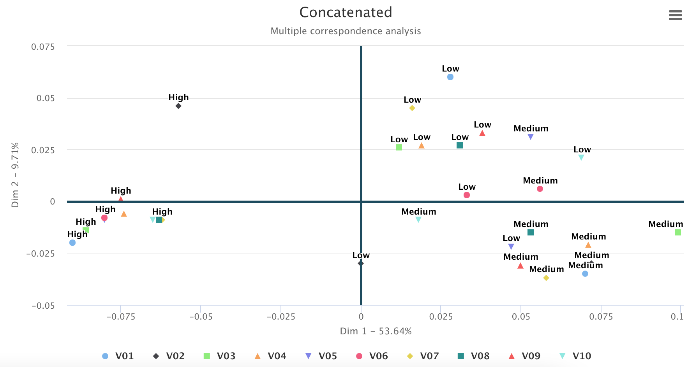

```{r setup, include=FALSE}
knitr::opts_chunk$set(echo = TRUE)
```


# Introduction

Los gráficos de control constituyen una de las herramientas más importantes para definir límites y parámetros óptimos de los procesos, así como para controlar la calidad de los productos mediante la reducción de la variabilidad. El uso de gráficos de control facilita la evaluación del comportamiento de las variables del proceso y contribuye al logro de los objetivos planificados.

La variación de los procesos se entiende como la diversidad de resultados que genera un grupo de variables, su monitoreo es un objetivo clave del control estadístico, por lo tanto, es necesario entender los tipos y motivos de la variabilidad. Para ello es preciso registrar de manera sistemática y adecuada diferentes variables del proceso que se desea controlar, como las propiedades de los insumos, las condiciones de operación de los equipos, las competencias del personal, además de las características de los productos, la satisfacción de los usuarios, el cumplimiento de requisitos, entre otras. 

El pionero del control estadístico de procesos fue Walter Shewhart (SPC). Estableció las diferencias entre la variabilidad natural o común, presente en todos los procesos, y la provocada por causas asignables o especiales, que pueden llevarlos a un estado de fuera de control. Señaló que un proceso está en control estadístico cuando trabaja sólo con causas comunes de variación. Propuso los primeros gráficos de control para variables de tipo continuo y para variables de atributos [@Gutierrez2013]. 

El SPC mediante gráficos de control permitió a las organizaciones monitorear el comportamiento de una variable a la vez, no obstante, las organizaciones requirieron, con el pasar del tiempo, el análisis de varias características de calidad de forma simultánea, abriendo la puerta al SPC desde una perspectiva multivariante [@ramos2017]. Para facilitar el control de calidad de procesos es común el uso de gráficas de control que recolectan abundante información en diversas variables de forma simultánea, su análisis permite caracterizar los diferentes tipos de variables que afectan la calidad y explican su comportamiento a lo largo del tiempo [@li2012].

Hay una variedad de gráficos de control de procesos desde la perspectiva multivariante, entre los  clásicos están el Gráfico $T^2$ de Hotelling [@hotelling1947], el Multivariate Exponentially Weighted Moving – MEWMA [@lowry1992], el Multivariate Cumulative Sum Control Chart – MCUSUM [@Crosier1988]. Con el transcurso del tiempo se hicieron diversos aportes para mejorar el rendimiento de estos gráficos, entre los más destacados están Gráfico de control $T^2$ con tamaños de muestra adaptables [@Aparisi1996], Gráfico de control $T^2$ con intervalos de muestreo variables [@Aparisi2001], Gráfico de control $T^2$ con líneas de advertencia dobles [@Faraz2006], Gráfico de control robusto [@shabbak2012], Gráficos de control basados en modelos de minería de datos para procesos multivariantes y autocorrelacionados [@kim2012], Gráficos de control de calidad multivariantes con dimensión variable [@ruiz2013], Gráfico de control para el coeficiente de variación multivariante [@yeong2016].

Además de estos gráficos de control para entornos paramétricos, se desarrollaron otros para datos numéricos y cualitativos en entornos multivariantes no paramétricos, entre ellos el Gráfico de control multivariante basado en la distancia de Gower para una combinación de variables continuas y cualitativas [@Tuerhong2014], Gráfico de control multivariante basado en la combinación de PCA para características de calidad de atributos y variables [@Muhammad2018], Gráfico de control multivariante no paramétrico basado en la ponderación de novedad sensible a la densidad para procesos no normales [@liu2020], Gráfico de control de deméritos con clustering difuso de c-medias [@yilmaz2020], Gráfico de control basado en ACP que utiliza máquinas de vectores de soporte para distribuciones no normales multivariadas [@Farokhnia], Gráfico CUSUM no paramétrico para monitorear procesos multivariados correlacionados en serie [@xue2020], Gráfico de control multivariante basado en Kernel PCA para monitorear características de calidad de atributos y variables mixtas [@Ahsan2020], Gráfico $T^2$ basado en la combinación de PCA para datos continuos y cualitativos con detección de datos atípicos [@Ahsan2021].

Como se puede observar, la literatura científica es abundante en lo referente a gráficos de control en entornos multivariantes paramétricos y no paramétricos para datos numéricos y, en los últimos años, para datos mixtos (numéricos y cualitativos), sin embargo, son pocas las publicaciones sobre gráficos de control multivariantes para datos cualitativos. En este campo las propuestas se han desarrollado alrededor del análisis de variables que siguen una distribución Poisson y el análisis de variables multinomiales.

La primera propuesta fue la de @holgate1964, quien presentó un trabajo sobre la distribución Poisson bivariante para variables correlacionadas. Este modelo fue tomado como insumo en las investigaciones de autores como @chiu2007, @ho2009, @laungrungrong2011ewma, @epprecht2013optimal. Otra propuesta destacada es la de @lu1998control, quien desarrolló un gráfico de control tipo Shewhart para procesos multivariados con variables de atributos, cuando la característica de calidad asume valores binarios, que se denominó gráfico *np* multivariante (MNP). No obstante, hay escenarios en los que una clasificación dicotómica es insuficiente y se vuelve necesario acudir a niveles intermedios, en cuyo caso el análisis requiere el uso de distribuciones multinomiales. 

En este contexto @ranjan2008multivariate planteó un gráfico de control multivariante utilizando el estadístico $D^2$ de Mahalanobis para atributos que siguen una distribución multinomial. Además, surgieron los gráficos de control multivariantes en procesos multinomiales bajo el enfoque difuso [@taleb2006multivariate]; @taleb2009control introdujo gráficos de control para el monitoreo de procesos multivariados con datos lingüísticos multidimensionales, basados en dos procedimientos: la teoría de la probabilidad y la teoría difusa; @pastuizaca2015multivariate presentaron un gráfico de control multivariante multinomial T2 con un enfoque difuso.

Un aporte interesante es el de @epprecht2013optimal, quienes presentaron una combinación lineal óptima de variables discretas, cuando siguen la distribución de Poisson, para el SPC multivariantes. Asimismo, @raza2019design desarrollaron gráficos de control para datos con distribución Poisson multivariante utilizando un muestreo generalizado de estados dependientes múltiples (GMDS).

@Saltos2020 aseguran que las herramientas de control de la calidad se pueden considerar no solo para monitorizar procesos industriales sino también procesos relacionados con la educación, por ejemplo, la evaluación del desempeño estudiantil. Estos autores aplicaron el concepto de profundidad, que transforma una observación multivariante a un índice univariante, el cual es susceptible de monitorizar en una carta de control y para esto utilizaron la carta r, además utilizaron clúster medio para establecer umbrales que faciliten la conformación de grupos y establecer perfiles de estudiantes mediante medidas descriptivas.

En el estudio de los procesos que se desarrollan en el entorno social-educativo y que explican el comportamiento de variables como el rendimiento académico, tasas de graduación o deserción, producción científica, porcentajes de matrícula de nuevo ingreso, entre otros, se maneja con mucha frecuencia variables cualitativas. No es que estén ausentes los datos cuantitativos, sino que, en las bases de datos que se utilizan para estos análisis, abundan las variables cualitativas nominales y ordinales sobre las de tipo numérico. Algunos ejemplos de datos de los estudiantes son: sexo, lugar de procedencia, autodenominación étnica, grado académico de los padres, tipo de institución educativa de procedencia (fiscal, particular, municipal), asistencia, seguimiento al sílabo, resultado (aprueba, no aprueba); ejemplos de datos de las instituciones son: tipo de sostenimiento económico, jornada, modalidad, campo de estudio, niveles (tecnológico, grado y postgrado), tipo de infraestructura; ejemplos asociados a datos de los profesores son: titularidad, dedicación, grado académico, grado en el escalafón, discapacidad, nivel de capacitación, avance académico, resultados de la evaluación de desempeño, entre otros.

@perez2004 señala que al observar muchas variables sobre una muestra es presumible que una parte de la información recogida pueda ser redundante o que sea excesiva, en cuyo caso los métodos multivariantes de reducción de la dimensión tratan de eliminarla combinando muchas variables observadas para quedarse con pocas variables ficticias que, aunque no observadas, sean combinación de las reales y sinteticen la mayor parte de la información contenida en sus datos. En este caso se deberá tener en cuenta el tipo de variables que maneja. Si son variables cuantitativas las técnicas que le permiten este tratamiento pueden ser el Análisis de componentes principales  [@Person1901;@Hotelling1933], el Análisis factorial [@ch1904; @thurstone1947; @kaiser1958], mientras que, si se trata de variables cualitativas, es recomendable la aplicación de un Análisis de correspondencias múltiple, Análisis de homogeneidad o un Análisis de Escalamiento multidimensional.    

En el control estadístico de procesos, los aportes al desarrollo de gráficos de control para variables cualitativas todavía son incipientes, las pocas publicaciones se orientan al análisis de características de la calidad en procesos industriales, pero no a procesos sociales como la educación. Al analizar los procedimientos publicados por los autores citados en este estudio, se detectan limitaciones que podrían restringir su aplicación, por ejemplo, el análisis de pocas características de la calidad, el uso de muestras constituidas por elementos individuales en vez de grupos, la dificultad de trabajar con muchas categorías de forma simultánea. Surge, entonces, la necesidad de un gráfico de control para la representación de *p* variables cualitativas, que pueda trabajar con múltiples categorías nominales y ordinales, que facilite la identificación de las causas que pueden llevar al proceso a un estado fuera de control y que pueda ser aplicado también procesos sociales.     

Esta necesidad se atiende en esta investigación, cuyo objetivo es desarrollar un gráfico de control para variables cualitativas con múltiples categorías nominales y ordinales, mediante la aplicación de una metodología de análisis multivariante, para que se contribuya a la diversificación de técnicas en la fase I del control estadístico de procesos.     


Este artículo está organizado de la siguiente manera: la Introducción, que establece los antecedentes conceptuales y referenciales de los gráficos de control multivariantes aplicados a variables cualitativas; la sección 2, materiales y métodos, que detalla el procedimiento que se siguió en el desarrollo del gráfico de control propuesto; la sección 3 describe al complemento computacional que facilita la aplicación de esta metodología; la sección 4 muestra los resultados mediante el análisis de datos simulados y datos reales aplicados al contexto de la educación superior; la sección 5 corresponde al análisis de sensibilidad que relaciona el número de dimensiones analizadas versus la confiabilidad de los resultados. La sección 6 presenta la discusión mediante un análisis comparativo entre el gráfico de control T2Qv y las propuestas de otros autores. Finalmente, la sección 7 establece las conclusiones.      

# Metodología

## Notación

La tabla \ref{tab:notacion} contiene elementos, representación y ejemplos de la manera como se presentan los elementos algebraicos abordados en la metodología.

\begin{table}[!ht]
\begin{center}
 \begin{tabular}{||c ||c |c ||} 
 \hline
 Elementos & Representación & Ejemplo \\
 \hline\hline
 Escalares & Letras en minúscula. & $v,\lambda$\\
\hline
Vectores & Letras en minúscula y en negrita. & $\mathbf{v},\mathbf{u}$\\
\hline
Matrices & Letras en mayúscula y en negrita. & $\mathbf{V},\mathbf{X}$\\
\hline
Matrices de tres vías (Cubos de datos) & Letras con doble trazo en mayúscula. & $\mathbb{C},\mathbb{X}$\\
\hline
\end{tabular}\caption{Elementos algebraicos}
\label{tab:notacion}
\end{center}
\end{table}

A lo largo del artículo se utilizarán letras para hacer referencia a parámetros necesarios, se los enuncia a continuación en la tabla \ref{tab:notacion2}:

\begin{table}[!ht]
\begin{center}
 \begin{tabular}{||c ||c | c ||} 
 \hline
 Letra &  Significado & Especificación\\
 \hline\hline
 $p$ & Número de dimensiones &\\
\hline
 $K$ & Número total de tablas (Especifica la profundidad del cubo de datos) & \\
 \hline
 $k$ & Índice de tabla &  k=1,2,...,K\\
  \hline
 $T$ & Índice de matriz transpuesta &  $\mathbf{X^{T}}$\\
\hline
 $n$ & Tamaño muestral de las $k$ tablas &\\
\hline
\end{tabular}\caption{Notación}
\label{tab:notacion2}
\end{center}
\end{table}


## Bases metodológicas

Para facilitar la explicación de la metodología se ha generado una base de datos que contiene 10 tablas, cada una con 10 variables categóricas, con los niveles *Bajo*, *Medio* y *Alto*, denominada *Datak10Contaminated*, que se describe con detalle en el apartado \nameref{simulados}.

### Análisis de Correspondencias Múltiples (MCA)

El tratamiento multivariante de variables cualitativas requiere un proceso metodológico distinto al que se aplica con variables cuantitativas, uno de los más representativos es el Análisis de Correspondencias [@Benzecri]. Según @perez2004, este análisis implica estudios de similaridad o disimilaridad entre categorías, se debe cuantificar la diferencia o distancia entre ellas sumando las diferencias cuadráticas relativas entre las frecuencias de las distribuciones de las variables analizadas, lo que conduce al concepto de la $\chi^2$.  Así, el análisis de correspondencias puede considerase como un análisis de componentes principales aplicado a variables cualitativas que, al no poder utilizar correlaciones, se basa en la distancia no euclídea de la$\chi^2$.      

En el enfoque francés del análisis de correspondencias, que se caracteriza por el énfasis en la geometría, el análisis de una tabla cruzada se llama análisis de correspondencias (CA) y el análisis de una colección de matrices indicadoras, se denomina análisis de correspondencias múltiples (MCA) [@michailidis1998]. En contextos anglosajones, el MCA es conocido como Análisis de Homogeneidad o Escalamiento Dual, especialmente en psicometría.

El análisis de correspondencias múltiples (MCA) es una generalización del análisis de correspondencias simple o binario, donde se incluyen más variables cualitativas. Se obtiene al realizar el análisis de correspondencias simple a una tabla disyuntiva completa, conocida como la tabla de Burt.    


\begin{table}[!ht]
\begin{center}
 \begin{tabular}{||c c c c||} 
 \hline
 $V_{1}$ & $V_{2}$ & $\cdots$ & $V_{p}$ \\ [0.5ex] 
 \hline\hline
 Alto & Medio & $\cdots$ & Medio\\
 \hline
Medio & Bajo & $\cdots$ & Alto\\
\hline
\vdots & $\vdots$ & $\vdots$ & $\vdots$\\
\hline
Bajo & Alto & $\cdots$ & Bajo \\ [1ex] 
 \hline
\end{tabular}\caption{Matriz inicial}
\label{tab:inicial}
\end{center}
\end{table}

Esta matriz es equivalente a la matriz disyuntiva $Z$, que desglosa las variables en cada una de sus modalidades y registra la ocurrencia de eventos de forma binaria.
\begin{table}[!ht]
\begin{center}
 \begin{tabular}{||p{1cm}p{1cm}p{1cm}||p{1cm}p{1cm} p{1cm} ||p{1cm} ||p{1cm} p{1cm} p{1cm} ||} 
 \hline
 $V_{1}:Alto$ &$V_{1}:Medio$ &$V_{1}:Bajo$ & $V_{2}:Alto$ & $V_{2}:Medio$ & $V_{2}:Bajo$ & $\cdots$ & $V_{p}:Alto$ & $V_{p}:Medio$ & $V_{p}:Bajo$ \\ [0.5ex] 
 \hline\hline
 1 & 0 & 0 & 0 & 1 & 0 & $\cdots$ & 0 & 1 & 0 \\ [0.2ex] 
 \hline
 0 & 1 & 0 & 0 & 0 & 1 & $\cdots$ & 1 & 0 & 0 \\ 
\hline
 0 & 0 & 1 & 0 & 0 &  1 & $\cdots$ & 0 & 0 & 1 \\ 
\hline
 $\vdots$ & $\vdots$ & $\vdots$ & $\vdots$ & $\vdots$ &  $\vdots$ & $\ddots$ & $\vdots$ & $\vdots$ & $\vdots$ \\ 
\hline
 0 & 0 & 1 & 1 & 0 & 0 & $\cdots$ & 0 & 0 & 1 \\  
 \hline
\end{tabular}
\caption{Matriz disyuntiva Z}
\label{tab:z}
\end{center}
\end{table}

La tabla de Burt viene dada por: 

\begin{equation}
\mathbf{B}=\mathbf{Z'}\mathbf{Z}
\label{eq:Burt}
\end{equation}

La construcción de la matriz de Burt se da por la superposición de tablas. En las tablas ubicadas en la diagonal se encuentran matrices diagonales que contienen las frecuencias marginales de cada una de las variables. Fuera de la diagonal de la matriz de Burt se encuentran las tablas cruzadas por pares de variables.        
Para realizar el análisis de correspondencias múltiples se parte de la matriz de Burt, obtenida con la ecuación \ref{eq:Burt}. Esta matriz está formada por las frecuencias absolutas, éstas se transforman en frecuencias relativas, dividiendo los valores de la matriz por la frecuencia total, dando lugar a una nueva matriz que se denominará **P**.

\begin{table}[!ht]
\begin{center}
 \begin{tabular}{| p{1.7cm} ||p{1cm}p{1cm}p{1cm}||p{1cm}p{1cm} p{1cm} ||p{1cm} ||p{1.3cm} p{1cm} p{1cm} ||} 
 \hline
  & $V_{1}:Alto$ &$V_{1}:Medio$ &$V_{1}:Bajo$ & $V_{2}:Alto$ & $V_{2}:Medio$ & $V_{2}:Bajo$ & $\cdots$ & $V_{p}:Alto$ & $V_{p}:Medio$ & $V_{p}:Bajo$ \\ [0.5ex] 
 \hline\hline
 $V_{1}:Alto$ & $b_{1,1}$ & 0 & 0  & $b_{1,4}$ & $b_{1,5}$ & $b_{1,6}$ & $\cdots$ & $b_{1,3p-2}$ & $b_{1,3p-1}$ & $b_{1,3p}$ \\
 $V_{1}:Medio$ & 0 & $b_{2,2}$ & 0 & $b_{2,4}$ & $b_{2,5}$ & $b_{2,6}$ & $\cdots$ & $b_{2,3p-2}$ & $b_{2,3p-1}$ & $b_{2,3p}$ \\ 
 $V_{1}:Bajo$ & 0 & 0 & $b_{3,3}$  & $b_{3,4}$ & $b_{3,5}$ & $b_{3,6}$ & $\cdots$ & $b_{3,3p-2}$ & $b_{3,3p-1}$ & $b_{3,3p}$ \\ 
\hline\hline
  $V_{2}:Alto$ & $b_{4,1}$ & $b_{4,2}$ & $b_{4,3}$ & $b_{4,4}$ & 0 & 0 & $\cdots$ & $b_{4,3p-2}$ & $b_{4,3p-1}$ & $b_{4,3p}$ \\
 $V_{2}:Medio$ & $b_{5,1}$ & $b_{5,2}$ & $b_{5,3}$ & 0 & $b_{5,5}$ & 0 & $\cdots$ & $b_{5,3p-2}$ & $b_{5,3p-1}$ & $b_{5,3p}$ \\ 
 $V_{2}:Bajo$ &  $b_{6,1}$ & $b_{6,2}$ & $b_{6,3}$ & 0 & 0 &  $b_{6,6}$ & $\cdots$& $b_{6,3p-2}$ & $b_{6,3p-1}$ & $b_{6,3p}$ \\ 
\hline\hline
 
 $\vdots$ & $\vdots$ & $\vdots$ & $\vdots$ & $\vdots$ & $\vdots$ & $\vdots$ & $\ddots$ & $\vdots$ & $\vdots$ & $\vdots$ \\ 
 
\hline\hline
 $V_{p}:Alto$  & $b_{3p-2,1}$   & $b_{3p-2,2}$   & $b_{3p-2,3}$   & $b_{3p-2,4}$   & $b_{3p-2,5}$   & $b_{3p-2,6}$    & $\cdots$ & $b_{3p-2,3p-2}$ & 0 & 0 \\
 $V_{p}:Medio$ & $b_{3p-1,1}$ & $b_{3p-1,2}$ & $b_{3p-1,3}$ & $b_{3p-1,4}$ & $b_{3p-1,5}$ & $b_{3p-1,6}$  & $\cdots$ & 0 & $b_{3p-1,3p-1}$ & 0 \\ 
 $V_{p}:Bajo$  & $b_{3p,1}$ & $b_{3p,2}$ & $b_{3p,3}$ & $b_{3p,4}$ & $b_{3p,5}$ & $b_{3p,6}$  & $\cdots$ & 0 & 0 & $b_{3p,3p}$ \\ 
\hline
\end{tabular}
\caption{P: Tabla de contingencia de Burt en frecuencias relativas}
\label{tab:p}
\end{center}
\end{table}


Se obtienen las marginales de las filas *(mf)* y de las columnas *(mc)* de la matriz **P** (Tabla \ref{tab:p}). A estos vectores se los conoce también como *Masas de fila y columna*, respectivamente.

\begin{table}[!ht]
\begin{center}
 \begin{tabular}{||p{1cm}p{1cm}p{1cm}||p{1cm}p{1cm} p{1cm} ||p{1cm} ||p{1cm} p{1cm} p{1cm} ||} 
 \hline
 $V_{1}:Alto$ &$V_{1}:Medio$ &$V_{1}:Bajo$ & $V_{2}:Alto$ & $V_{2}:Medio$ & $V_{2}:Bajo$ & $\cdots$ & $V_{p}:Alto$ & $V_{p}:Medio$ & $V_{p}:Bajo$ \\ [0.5ex] 
 \hline
    $b_{1,\bullet}$ & $b_{2, \bullet}$ & $b_{3, \bullet}$ & $b_{4, \bullet}$ & $b_{5, \bullet}$ & $b_{6, \bullet}$ & $\cdots$ & $b_{3p-2, \bullet}$ & $b_{3p-1,\bullet}$ & $b_{3p, \bullet}$ \\ [0.5ex] 
 \hline
\end{tabular}
\caption{Frecuencias marginales de las filas. (mf)}
\label{tab:margfilas}
\end{center}
\end{table}

\begin{table}[h!]
\begin{center}
 \begin{tabular}{||p{1cm}p{1cm}p{1cm}||p{1cm}p{1cm} p{1cm} ||p{1cm} ||p{1cm} p{1cm} p{1cm} ||} 
 \hline
 $V_{1}:Alto$ &$V_{1}:Medio$ &$V_{1}:Bajo$ & $V_{2}:Alto$ & $V_{2}:Medio$ & $V_{2}:Bajo$ & $\cdots$ & $V_{p}:Alto$ & $V_{p}:Medio$ & $V_{p}:Bajo$ \\ [0.5ex] 
 \hline
    $b_{\bullet,1}$ & $b_{\bullet,2}$ & $b_{\bullet,3}$ & $b_{\bullet,4}$ & $b_{\bullet,5}$ & $b_{\bullet,6}$ & $\cdots$ & $b_{\bullet,3p-2}$ & $b_{\bullet,3p-1}$ & $b_{\bullet,3p}$ \\ [0.5ex] 
 \hline
\end{tabular}
\caption{Frecuencias marginales de las columnas. (mc)}
\label{tab:margcolumnas}
\end{center}
\end{table}


Se obtiene la matriz de residuos estandarizados **S**.

\begin{equation}
\mathbf{S}=\mathbf{D_{fila}}^{-\frac{1}{2}}(\mathbf{P}-\mathbf{mf} \hspace{0.2cm} \mathbf{mc'})\mathbf{D_{columna}}^{-\frac{1}{2}}
\label{eq:s}
\end{equation}
donde $\mathbf{D_{fila}}$ es una matriz diagonal que contiene las masas de las filas y $\mathbf{D_{columna}}$ es una matriz diagonal que contiene las masas de las columnas.  

Se aplica descomposición singular (SVD) a la matriz **S** (Ecuación \ref{eq:s}):

\begin{equation}
\mathbf{S}=\mathbf{U}\mathbf{D}\mathbf{V'}
\label{eq:svd}
\end{equation}
donde $\mathbf{U}$ y $\mathbf{V}$ son matrices ortogonales y $\mathbf{D}$ es una matriz diagonal que contiene los valores singulares. 


Para encontrar las coordenadas estandarizadas se aplica lo siguiente:

\begin{equation}
\mathbf{X}=\mathbf{D_{fila}}^{-\frac{1}{2}} \mathbf{U}
\label{eq:xcoor}
\end{equation}

\begin{equation}
\mathbf{Y}=\mathbf{D_{columna}}^{-\frac{1}{2}} \mathbf{V}
\label{eq:ycoor}
\end{equation}

Para la elaboración del gráfico T2Qv se utilizará las coordenadas de las columnas (Tabla \ref{tab:colcoor}).

\begin{table}[!ht]
\begin{center}
 \begin{tabular}{|| c ||c c c c||} 
 \hline
 & $Dim_{1}$      & $Dim_{2}$ & $\cdots$ & $Dim_{3p}$ \\ [0.5ex] 
 \hline\hline
  $V_{1}:Alto$    & ${v_{1}d_{1}}_{alto}$& ${v_{1}d_{1}}_{alto}$  & $\cdots$ & ${v_{1}d_{p}}_{alto}$\\
 \hline
 $V_{1}:Medio$    &${v_{1}d_{1}}_{medio}$ & ${v_{1}d_{1}}_{medio}$ & $\cdots$ & ${v_{1}d_{p}}_{medio}$\\
\hline
 $V_{1}:Bajo$     &${v_{1}d_{1}}_{bajo}$ & ${v_{1}d_{1}}_{bajo}$  &$\cdots$ & ${v_{1}d_{p}}_{bajo}$\\
\hline
\vdots & $\vdots$ & $\vdots$  &$\ddots$& $\vdots$\\
\hline
 $V_{p}:Bajo$     &${v_{p}d_{1}}_{bajo}$ & ${v_{p}d_{1}}_{bajo}$ & $\cdots$ & ${v_{p} d_{p}} _{bajo}$ \\ [1ex] 
 \hline
\end{tabular}\caption{Coordenadas estandarizadas de las columnas.}
\label{tab:colcoor}
\end{center}
\end{table}

### Generalización a $k$ tablas

Si se tienen *k* tablas, con la misma estructura de la tabla \ref{tab:inicial}, como se visualiza en la figura \ref{fig:ktables}, se aborda el enfoque del análisis factorial múltiple (MFA). @AFM indican que el MFA utiliza análisis de correspondencias múltiples cuando se trata de variables cualitativas. El procedimiento implica la realización de un MCA por cada tabla y dividirlo para su primer valor propio con la finalidad de obtener $K$ grupos normalizados.

\begin{figure}[!ht]


```{r diagram, echo=FALSE, fig.align='center',results='asis', fig.pos="H", out.extra = "", out.width='40%', fig.width=16, fig.height=9}
knitr::include_graphics("ktables.png")
```

\caption{$k$ tablas con el formato inicial.}

\label{fig:ktables}
\end{figure}

La generalización a *k* tablas del procedimiento del MCA, se presenta en la Figura \ref{fig:MCAk}


\begin{figure}[!h]

```{r , echo=FALSE, fig.align='center',results='asis', fig.pos="h", out.extra = "", out.width='90%', fig.width=16, fig.height=9}
knitr::include_graphics("ktablesMCA.png")
```

\caption{Procedimiento del MCA para $k$ tablas}

\label{fig:MCAk}
\end{figure}

Se llama $C$ a cada tabla de coordenadas. Con la finalidad de detectar la magnitud de las variables latentes, su aporte neto a las variables, se trata la matriz $C$ con valor absoluto.      
Hasta este punto se tiene un conjunto de matrices de coordenadas, cuyas filas contienen las variables observadas y las columnas, las variables latentes.

### Normalización de tablas

Una vez que se tienen las coordenadas de las columnas, se procede a realizar la normalización, característica del procedimiento *Análisis factorial múltiple (MFA)*.

Sea $\lambda_{1}^{k}$ el primer valor propio obtenido de la descomposición singular de la k-ésima tabla C. Se normaliza la tabla multiplicándola por $1/\lambda_{1}^{k}$. Con esto se obtiene la tabla $C^{'}$, que corresponde a la tabla de coordenadas normalizadas.    
Individualmente, para el caso de la matriz k, se tendría la siguiente expresión.

\begin{equation}
\mathbf{C'_k}=\frac{1}{\lambda_{k}^1} \mathbf{C_k}
\label{eq:Cprimak}
\end{equation}

La expresión de la ecuación \ref{eq:Cprimak} aplicada a k tablas se representa en la figura \ref{fig:esquema1}, que muestra el esquema de preparación de las tablas, previo a la obtención de vectores de centralidad usados por el gráfico de control multivariante.       
Hasta este punto se tiene un conjunto de matrices de coordenadas normalizadas, cuyas filas contienen las variables observadas y las columnas, las variables latentes.

\begin{figure}[!h]

```{r , echo=FALSE, fig.align='center',results='asis', fig.pos="h", out.extra = "", out.width='90%', fig.width=16, fig.height=9}

```

\caption{Esquema de preparación de las k tablas.}

\label{fig:esquema1}
\end{figure}

Aglomerando las matrices normalizadas $C^{'}$ en una sola, se tiene la matriz $\mathbb{C}^{'}$, denominada Matriz Concatenada. Esta contiene todos los elementos de las *k* tablas normalizadas.

\begin{equation}
\mathbf{\mathbb{C^{'}}}=[\mathbf{C_1^{'}}|\mathbf{C_2^{'}}|,...,|\mathbf{C'_{K}}]^{T}
\label{eq:Cprima}
\end{equation}

La normalización que realiza el MFA se encarga de ponderar las *k* tablas, con el objetivo de evitar alguna descompensación al momento de realizar el análisis conjunto de las tablas. 

Una vez que se tiene las matrices $\mathbf{\mathbb{C^{'}}}$ y  $\mathbf{C_k^{'}}$, se procede a obtener los vectores de mediana, tal como se muestra en la figura \ref{fig:esquema2}.
El vector $\mathbf{\tilde{x}_{C_k^{'}}}$ explicará el comportamiento central de la tabla k y el vector $\mathbf{\tilde{x}_{\mathbb{C^{'}}}}$ explicará el comportamiento de la matriz concatenada.

\begin{figure}[!h]

```{r , echo=FALSE, fig.align='center',results='asis', fig.pos="h", out.extra = "", out.width='90%', fig.width=16, fig.height=9}

```

\caption{Esquema de obtención de vectores de medianas}

\label{fig:esquema2}
\end{figure}

## Gráfico de control T2Qv

### Obtención del gráfico de control

Para definir el gráfico de control $T^2$ Hotelling se deben tomar las siguientes consideraciones:

- La tabla $\mathbb{C}^{'}$ (Ecuación \ref{eq:Cprima}) se denomina Concatenada, sirve como referente para el escenario *bajo control*.
- El estadístico $T^2$ Hotelling normalmente se calcula con los vectores de media y considera la variabilidad de todas las tablas, incluyendo las que estén potencialmente contaminadas, es decir, las que se representarían como puntos fuera de control en el gráfico T2Qv. Esto puede generar un problema, dado que, en esta fase I se espera que la matriz concatenada capture el comportamiento "en control". Para resolver este inconveniente se suele excluir del análisis a las tablas que difieren del comportamiento normal, sin embargo, la propuesta de esta investigación es adoptar conceptos de robustez, utilizando el vector de medianas  en vez de el de medias, en virtud de que a las medianas no les afectan los valores atípicos.
- 	De la matriz concatenada $\mathbb{C}^{'}$  se obtiene $\tilde{x_{0}}$ (Vector de medianas de la matriz concatenada) y $S_0$ (Matriz de covarianzas de la matriz concatenada).
- Cada matriz $\mathbf{C'_k}$ tiene el mismo número de columnas (p) (variables).
- El vector de medias $\tilde{x_{k}}$ está atado a la tabla $\mathbf{C'_k}$, es decir, el gráfico de control estará en función de las diferencias entre las matrices $\mathbf{C'_k}$ y la matriz concatenada $\mathbf{\mathbb{C^{'}}}$.
- Las matrices $\mathbf{C'_k}$ siguen una distribución normal multivariante con vector de centralidad $\tilde{x_{k}}$ y matriz de covarianzas $\mathbf{S_k}$.


El estadístico $T^2$ viene dado por:

\begin{equation}
T^2=n (\mu_{k}-\mu_{0})'\mathbf{\Sigma_{0}^{-1}}(\mu_{k}-\mu_{0})
\label{eq:T2}
\end{equation}

Tomando en cuenta las consideraciones previas, se obtiene el estadístico $T^2_{med}$ 

\begin{equation}
T^2_{med}=n (\tilde{x_{k}}-\tilde{x_{0}})'\mathbf{\Sigma_{0}^{-1}}(\tilde{x_{k}}-\tilde{x_{0}})
\label{eq:T2med}
\end{equation}

Se sabe que, bajo control, el $T^2$ se distribuye como una Chi-cuadrado con $p$ grados de libertad $\chi^2_p$. En este caso se puede aplicar este principio, ya que se utiliza la matriz concatenada 
($\mathbb{C}^{'}$), que representa al escenario bajo control. 

Dado que este gráfico de control está basado en distancias de Mahalanobis ponderadas, sólo tiene límite de control superior. Este viene dado por la ecuación \ref{eq:UCL}

\begin{equation}
UCL=\chi^2_{\alpha,p}
\label{eq:UCL}
\end{equation}

donde $p$ es el número de dimensiones y $\alpha$ es la significancia predeterminada, se considera $\alpha=0.0027$.


### Interpretación de puntos fuera de control

El gráfico multivariante $T^2$ de Hotelling para variables cualitativas es capaz de señalar que el proceso salió de control, pero no permite reconocer el momento ni las causas por las que ocurrió esto. Es obvio que, más allá de reconocer el estado del proceso, interesa saber cuándo y por qué salió de control. Es importante tener en cuenta que cada punto representado en el gráfico $T^2$ de Hotelling representa a una tabla (muestra), constituida por un grupo de individuos (observaciones) y *p* variables que pueden tener muchas categorías, algunas de éstas pueden mostrar un comportamiento anómalo. Por consiguiente, es necesario analizar con detenimiento que está pasando con los datos de las tablas reportadas.

Este análisis se realiza comparando la ubicación de los puntos que representan las categorías de las variables en el MCA de la tabla concatenada y la ubicación de los puntos en los gráficos MCA de cada tabla reportada como fuera de control. Las categorías que están incidiendo en el estado fuera de control son aquellas cuya ubicación en ambas tablas comparadas muestra diferencias importantes. Para cuantificar la magnitud del comportamiento anómalo de estas categorías se calcula las distancias Chi-cuadrado entre las masas de las columnas de la tabla reportada como fuera de control y las de la tabla concatenada, tomada como referente. Mientras mayor es el valor del estadístico, mayor es su incidencia en el desplazamiento de la centralidad del proceso que, finalmente, pueden llevarlo a un estado fuera de control.

## Gráfico de diferencias Chi Cuadrado

Consiste en un gráfico interactivo de barras que representa a las distancias $\chi^2$ entre las masas de columna de las variables de la tabla concatenada y la tabla *i*, que podría ser la que está fuera de control u otra que se quisiera analizar. Las barras que denotan mayor altura son las que más están incidiendo en la variación de la tendencia central del proceso y, por consiguiente, su salida de control. Para proporcionar mayor detalle, este gráfico interactivo también ofrece, mediante un gráfico circular anidado, una representación de la distribución de las categorías de la variable observada, correspondiente a la tabla *i*, así como un gráfico circular de la distribución de las categorías de la tabla concatenada.      
De esta manera, la metodología propuesta en esta investigación permite explicar cuándo y por qué el proceso salió de control. 


# Complemento computacional

Para facilitar la difusión y aplicación del método propuesto, se ha desarrollado un paquete reproducible en R. El paquete **T2Qv** [@T2Qv] realiza el análisis de control de *k* tablas por medio de gráficos de control multivariantes para variables cualitativas, utilizando los fundamentos del análisis de correspondencias múltiples y el análisis factorial múltiple. Los gráficos se pueden mostrar de forma plana o interactiva, de la misma manera todas las salidas se pueden mostrar en un panel interactivo de Shiny. 

## Disponibilidad

El paquete está disponible en el repositorio oficial de R, The Comprehensive R Archive Network (CRAN), la descarga se la puede realizar de la siguiente forma:

```
install.packages("T2Qv")
```

## El paquete: T2Qv

\begin{figure}[!ht]


```{r , echo=FALSE, fig.align='center',results='asis', fig.pos="H", out.extra = "", out.width='60%', fig.width=16, fig.height=9}
knitr::include_graphics("DescrPack.png")
```

\caption{Documentación del paquete T2Qv}

\label{fig:documentation}
\end{figure}

Las funciones que contiene el paquete y su descripción se enuncian en la tabla \ref{tab:functions}.

\begin{table}[h!]
\begin{center}
 \begin{tabular}{||c  m{35em}||} 
 \hline
  Función & Descripción \\ [0.5ex] 
 \hline\hline
 T2 qualitative & Multivariate control chart T2 Hotelling applicable for qualitative variables.\\
 \hline
  MCAconcatenated & Multiple correspondence analysis applied to a concatenated table.\\
\hline
  MCApoint & Multiple correspondence analysis applied to a specific table.\\
\hline
  ChiSq variable & Contains Chi square distance between the column masses of the table specified in PointTable and the concatenated table. It allows to identify which mode is responsible for the anomaly in the table in which it is located. \\ [1ex] 
  \hline
  Full Panel & A shiny panel complete with the 
  multivariate control chart for 
  qualitative variables, the two MCA 
  charts and the modality distance table. 
  Within the dashboard, arguments such as 
  type I error and dimensionality can be 
  modified. \\ [1ex] 
 \hline
\end{tabular}\caption{Funciones del paquete T2Qv}
\label{tab:functions}
\end{center}
\end{table}

2022-2023
# Resultados

Con la intención de probar la metodología propuesta en el gráfico de control $T^2$ de Hotelling para variables cualitativas, se hizo un análisis con datos simulados y otro con datos reales aplicados al contexto de la educación superior. Los resultados se obtienen de la aplicación del paquete T2Qv.

## Resultados con datos simulados

### Generación de datos simulados
\label{simulados}

Para este estudio se generó una base de datos simulados, a la que se denominó *Datak10Contaminated*. Consta de 10 tablas, cada una de ellas está constituida por 100 filas (observaciones) y 11 columnas, de las cuales, las 10 primeras corresponden a las variables analizadas (V1, V2, …; V10), mismas que contienen 3 categorías (Alto, Medio y Bajo), mientras que, la columna 11, denominada *GroupLetter*, contiene el factor de clasificación de los grupos. Para su identificación, las tablas han sido denominadas con las letras del alfabeto, desde la *a* hasta la *j*. La tabla *j* tiene una distribución distinta de la que tienen las otras nueve.
Las 9 primeras tablas tienen sus 10 variables con la siguiente distribución:

$$ u \sim U[0,1]$$

$$t_{1,..,9}= \left\{ \begin{array}{lcc}
             Bajo &   si  & u \leq 1/3 \\
             \\ Medio &  si & 1/3 < u < 2/3 \\
             \\ Alto &  si  & u \geq 2/3 
             \end{array}
   \right. $$

La tabla 10, en todas sus 10 variables, sigue la distribución presentada a continuación:

$$ u \sim U[0,1]$$

$$t_{10}= \left\{ \begin{array}{lcc}
             Bajo &   si  & u \leq 1/5 \\
             \\ Medio &  si & 1/5 < u < 2/6 \\
             \\ Alto &  si  & u \geq 2/6 
             \end{array}
   \right. $$


La base de datos se presenta en el formato establecido en la tabla \ref{tab:tabladatos}.

\begin{table}[!ht]
\tiny
\centering
\resizebox{13cm}{!} {
\begin{tabular}{@{}lllllllllll@{}}
\toprule
\textbf{V1}                  & \textbf{V2}                    & \textbf{V3}                  & \textbf{V4}                    & \textbf{V5}                  & \textbf{V6}                    & \textbf{V7}                    & \textbf{V8}                    & \textbf{V9}                    & \textbf{V10}                   & \textbf{GroupLetter}      \\ \midrule
Low      & Medium     & Medium                       & High                           & High                         & High                           & Low                            & Medium                         & Medium                         & Medium                         & a                         \\
Low                          & Low                            & High                         & Low                            & Medium                       & High                           & High                           & High                           & Low                            & High                           & a \\
High & Medium & High & Low    & High & Medium & Medium & High   & Medium & Low    & a                         \\
Medium                       & Medium                         & Low                          & High                           & Low                          & Medium                         & High                           & Low                            & Low                            & High                           & a \\
Low  & Low    & Low  & High   & Low  & High   & High   & High   & Medium & Medium & a                         \\
High                         & High                           & Medium                       & Low                            & High                         & Low                            & Medium                         & Medium                         & High                           & Low                            & a \\
High & High   & Low  & Low    & Low  & Medium & High   & Medium & Medium & High   & a                         \\
Medium                       & Medium                         & High                         & Medium                         & Medium                       & High                           & Medium                         & High                           & High                           & High                           & a \\
Low  & Low    & Low  & Medium & High & Medium & Low    & Medium & Low    & Low    & a                         \\
Medium                       & Medium                         & Medium                       & High                           & Low                          & Medium                         & High                           & Low                            & High                           & Medium                         & a \\ \bottomrule
\end{tabular}
}

\caption{Sección de la base de datos $Datak10Contaminated$.}

\label{tab:tabladatos}

\end{table}


Para verificar la diferencia entre las distribuciones de la tabla 10 y las demás, se calculó el promedio de las frecuencias relativas en las tres categorías, desde la tabla *a* hasta la *i*, para las 10 variables (Tabla \ref{tab:tablan}), luego se calculó el promedio de las frecuencias relativas medias de las 10 variables, el resultado permite comparar la distribución de las categorías de la tabla *Datak10Contaminated* con la distribución teórica uniforme, como se observa en la tabla \ref{tab:tablapromfreq}.


\begin{table}[H]
\centering
\begin{tabular}{@{}clrrrrrrrrrr@{}}
\toprule
\textbf{Tabla} & \textbf{Categoría} & \multicolumn{1}{l}{\textbf{V1}} & \multicolumn{1}{l}{\textbf{V2}} & \multicolumn{1}{l}{\textbf{V3}} & \multicolumn{1}{l}{\textbf{V4}} & \multicolumn{1}{l}{\textbf{V5}} & \multicolumn{1}{l}{\textbf{V6}} & \multicolumn{1}{l}{\textbf{V7}} & \multicolumn{1}{l}{\textbf{V8}} & \multicolumn{1}{l}{\textbf{V9}} & \multicolumn{1}{l}{\textbf{V10}} \\ \midrule
\rowcolor[HTML]{D9D9D9} 
\textbf{a}     & \textbf{High}      & 0.29                               & 0.25                               & 0.36                               & 0.38                               & 0.38                               & 0.35                               & 0.36                               & 0.29                               & 0.33                               & 0.37                                \\
\rowcolor[HTML]{D9D9D9} 
\textbf{a}     & \textbf{Medium}    & 0.36                               & 0.49                               & 0.34                               & 0.34                               & 0.31                               & 0.41                               & 0.38                               & 0.28                               & 0.38                               & 0.31                                \\
\rowcolor[HTML]{D9D9D9} 
\textbf{a}     & \textbf{Low}       & 0.35                               & 0.26                               & 0.30                               & 0.28                               & 0.31                               & 0.24                               & 0.26                               & 0.43                               & 0.29                               & 0.32                                \\
\textbf{b}     & \textbf{High}      & 0.31                               & 0.44                               & 0.37                               & 0.29                               & 0.31                               & 0.34                               & 0.30                               & 0.36                               & 0.29                               & 0.34                                \\
\textbf{b}     & \textbf{Medium}    & 0.40                               & 0.31                               & 0.30                               & 0.35                               & 0.37                               & 0.32                               & 0.35                               & 0.30                               & 0.39                               & 0.36                                \\
\textbf{b}     & \textbf{Low}       & 0.29                               & 0.25                               & 0.33                               & 0.36                               & 0.32                               & 0.34                               & 0.35                               & 0.34                               & 0.32                               & 0.30                                \\
\rowcolor[HTML]{D9D9D9} 
\textbf{c}     & \textbf{High}      & 0.34                               & 0.33                               & 0.25                               & 0.35                               & 0.32                               & 0.30                               & 0.39                               & 0.40                               & 0.41                               & 0.43                                \\
\rowcolor[HTML]{D9D9D9} 
\textbf{c}     & \textbf{Medium}    & 0.36                               & 0.33                               & 0.25                               & 0.32                               & 0.32                               & 0.32                               & 0.27                               & 0.35                               & 0.32                               & 0.35                                \\
\rowcolor[HTML]{D9D9D9} 
\textbf{c}     & \textbf{Low}       & 0.30                               & 0.34                               & 0.50                               & 0.33                               & 0.36                               & 0.38                               & 0.34                               & 0.25                               & 0.27                               & 0.22                                \\
\textbf{d}     & \textbf{High}      & 0.32                               & 0.34                               & 0.34                               & 0.38                               & 0.41                               & 0.33                               & 0.35                               & 0.46                               & 0.34                               & 0.45                                \\
\textbf{d}     & \textbf{Medium}    & 0.35                               & 0.30                               & 0.28                               & 0.31                               & 0.27                               & 0.35                               & 0.30                               & 0.24                               & 0.33                               & 0.24                                \\
\textbf{d}     & \textbf{Low}       & 0.33                               & 0.36                               & 0.38                               & 0.31                               & 0.32                               & 0.32                               & 0.35                               & 0.30                               & 0.33                               & 0.31                                \\
\rowcolor[HTML]{D9D9D9} 
\textbf{e}     & \textbf{High}      & 0.32                               & 0.32                               & 0.36                               & 0.26                               & 0.36                               & 0.31                               & 0.29                               & 0.28                               & 0.32                               & 0.41                                \\
\rowcolor[HTML]{D9D9D9} 
\textbf{e}     & \textbf{Medium}    & 0.34                               & 0.40                               & 0.34                               & 0.40                               & 0.38                               & 0.37                               & 0.27                               & 0.37                               & 0.32                               & 0.23                                \\
\rowcolor[HTML]{D9D9D9} 
\textbf{e}     & \textbf{Low}       & 0.34                               & 0.28                               & 0.30                               & 0.34                               & 0.26                               & 0.32                               & 0.44                               & 0.35                               & 0.36                               & 0.36                                \\
\textbf{f}     & \textbf{High}      & 0.31                               & 0.29                               & 0.27                               & 0.32                               & 0.36                               & 0.32                               & 0.26                               & 0.41                               & 0.34                               & 0.26                                \\
\textbf{f}     & \textbf{Medium}    & 0.41                               & 0.29                               & 0.36                               & 0.31                               & 0.31                               & 0.38                               & 0.36                               & 0.33                               & 0.30                               & 0.37                                \\
\textbf{f}     & \textbf{Low}       & 0.28                               & 0.42                               & 0.37                               & 0.37                               & 0.33                               & 0.30                               & 0.38                               & 0.26                               & 0.36                               & 0.37                                \\
\rowcolor[HTML]{D9D9D9} 
\textbf{g}     & \textbf{High}      & 0.27                               & 0.39                               & 0.34                               & 0.38                               & 0.28                               & 0.31                               & 0.35                               & 0.38                               & 0.27                               & 0.34                                \\
\rowcolor[HTML]{D9D9D9} 
\textbf{g}     & \textbf{Medium}    & 0.42                               & 0.27                               & 0.32                               & 0.35                               & 0.37                               & 0.32                               & 0.35                               & 0.36                               & 0.41                               & 0.26                                \\
\rowcolor[HTML]{D9D9D9} 
\textbf{g}     & \textbf{Low}       & 0.31                               & 0.34                               & 0.34                               & 0.27                               & 0.35                               & 0.37                               & 0.30                               & 0.26                               & 0.32                               & 0.40                                \\
\textbf{h}     & \textbf{High}      & 0.32                               & 0.47                               & 0.34                               & 0.38                               & 0.47                               & 0.34                               & 0.32                               & 0.35                               & 0.35                               & 0.31                                \\
\textbf{h}     & \textbf{Medium}    & 0.28                               & 0.31                               & 0.29                               & 0.27                               & 0.27                               & 0.43                               & 0.39                               & 0.35                               & 0.36                               & 0.40                                \\
\textbf{h}     & \textbf{Low}       & 0.40                               & 0.22                               & 0.37                               & 0.35                               & 0.26                               & 0.23                               & 0.29                               & 0.30                               & 0.29                               & 0.29                                \\
\rowcolor[HTML]{D9D9D9} 
\textbf{i}     & \textbf{High}      & 0.32                               & 0.42                               & 0.29                               & 0.30                               & 0.26                               & 0.28                               & 0.38                               & 0.38                               & 0.36                               & 0.36                                \\
\rowcolor[HTML]{D9D9D9} 
\textbf{i}     & \textbf{Medium}    & 0.35                               & 0.34                               & 0.29                               & 0.33                               & 0.47                               & 0.38                               & 0.25                               & 0.29                               & 0.33                               & 0.31                                \\
\rowcolor[HTML]{D9D9D9} 
\textbf{i}     & \textbf{Low}       & 0.33                               & 0.24                               & 0.42                               & 0.37                               & 0.27                               & 0.34                               & 0.37                               & 0.33                               & 0.31                               & 0.33                                \\
\textbf{j}     & \textbf{High}      & 0.75                               & 0.71                               & 0.78                               & 0.71                               & 0.70                               & 0.73                               & 0.69                               & 0.66                               & 0.73                               & 0.78                                \\
\textbf{j}     & \textbf{Medium}    & 0.08                               & 0.10                               & 0.01                               & 0.06                               & 0.10                               & 0.12                               & 0.11                               & 0.12                               & 0.12                               & 0.10                                \\
\textbf{j}     & \textbf{Low}       & 0.17                               & 0.19                               & 0.21                               & 0.23                               & 0.20                               & 0.15                               & 0.20                               & 0.22                               & 0.15                               & 0.12                                \\
\rowcolor[HTML]{D9D9D9} 
$\bar{x}_{a, b, ...,  i}$        & \textbf{High}      & \textbf{0.31}                      & \textbf{0.37}                      & \textbf{0.33}                      & \textbf{0.33}                      & \textbf{0.35}                      & \textbf{0.32}                      & \textbf{0.33}                      & \textbf{0.37}                      & \textbf{0.33}                      & \textbf{0.36}                       \\
\rowcolor[HTML]{D9D9D9} 
$\bar{x}_{a, b, ...,  i}$          & \textbf{Medium}    & \textbf{0.37}                      & \textbf{0.34}                      & \textbf{0.31}                      & \textbf{0.33}                      & \textbf{0.34}                      & \textbf{0.36}                      & \textbf{0.33}                      & \textbf{0.32}                      & \textbf{0.35}                      & \textbf{0.32}                       \\
\rowcolor[HTML]{D9D9D9} 
$\bar{x}_{a, b, ...,  i}$           & \textbf{Low}       & \textbf{0.32}                      & \textbf{0.30}                      & \textbf{0.36}                      & \textbf{0.33}                      & \textbf{0.31}                      & \textbf{0.32}                      & \textbf{0.34}                      & \textbf{0.32}                      & \textbf{0.32}                      & \textbf{0.32}                       \\ \bottomrule
\end{tabular}
\caption{Promedio de frecuencias relativas medias en las tres categorías, desde la tabla $a$ hasta la $i$. $Data10Contaminated$}

\label{tab:tablan}
\end{table}


\begin{table}[H]
\centering
\begin{tabular}{rccc}
\hline
\toprule

\textbf{Categorías} & \textbf{Teórica uniforme} & \textbf{Promedio Tablas $a$, $b$, ...,  $i$} & \textbf{Promedio Tabla $j$} \\ \midrule
\textbf{High}       & 0.333            & 0.340                & 0.724            \\ 
\textbf{Medium}     & 0.333            & 0.336                & 0.092            \\ 
\textbf{Low}        & 0.333            & 0.324                & 0.184            \\ \midrule
\end{tabular}
\caption{Comparación de la distribución de las categorías de la tabla $Datak10Contaminated$	con la distribución teórica uniforme.}
\label{tab:tablapromfreq}
\end{table}

Con estos datos se aplicaron pruebas Chi cuadrado de bondad de ajuste. Las hipótesis nulas consideran que la distribución de las categorías de la tabla *j* es igual que la distribución de cada una de las demás tablas (uniforme Low 0.333, Medium  0.333 y High 0.333). Se encontró, con un nivel de confianza del 95%, que las distribuciones de todas las variables de la tabla *j* mostraron diferencias estadísticamente significativas con las distribuciones de las variables de las demás tablas, con 2 grados de libertad. La tabla \ref{tab:tablapromfreqsumm} presenta el resumen de los estadísticos de prueba respectivos. Como conclusión se ratifica que la tabla *j* tiene una distribución diferente de todas las demás tablas.

\begin{table}[H]
\centering
\begin{tabular}{llrrrrrrrrrr}
\toprule
\multicolumn{1}{c}{\textbf{GroupLetter}} & \multicolumn{1}{c}{\textbf{Estadísticos}} & \multicolumn{1}{c}{\textbf{V1}}      & \multicolumn{1}{c}{\textbf{V2}}      & \multicolumn{1}{c}{\textbf{V3}}      & \multicolumn{1}{c}{\textbf{V4}}      & \multicolumn{1}{c}{\textbf{V5}}      & \multicolumn{1}{c}{\textbf{V6}}      & \multicolumn{1}{c}{\textbf{V7}}      & \multicolumn{1}{c}{\textbf{V8}}      & \multicolumn{1}{c}{\textbf{V9}}      & \multicolumn{1}{c}{\textbf{V10}}     \\ \midrule

                                           & Chi-cuadrado                               & 0.86                                  & 11.06                                 & 0.56                                  & 1.52                                  & 0.98                                  & 4.46                                  & 2.48                                  & 4.22                                  & 1.22                                  & 0.62                                  \\ \cline{2-12} 
\multirow{-2}{*}{\textbf{a}}               & \textit{p-valor}                           & \textit{0.651}                        & {\color[HTML]{C00000} \textit{0.004}} & \textit{0.756}                        & \textit{0.468}                        & \textit{0.613}                        & \textit{0.108}                        & \textit{0.289}                        & \textit{0.121}                        & \textit{0.543}                        & \textit{0.733}                        \\ \hline
                                           & Chi-cuadrado                               & 2.06                                  & 5.66                                  & 0.74                                  & 0.86                                  & 0.62                                  & 0.08                                  & 0.50                                  & 0.56                                  & 1.58                                  & 0.56                                  \\ \cline{2-12} 
\multirow{-2}{*}{\textbf{b}}               & p-valor                                    & \textit{0.357}                        & \textit{0.059}                        & \textit{0.691}                        & \textit{0.651}                        & \textit{0.733}                        & \textit{0.961}                        & \textit{0.779}                        & \textit{0.756}                        & \textit{0.454}                        & \textit{0.756}                        \\ \hline
                                           & Chi-cuadrado                               & 0.56                                  & 0.02                                  & 12.50                                 & 0.14                                  & 0.32                                  & 1.04                                  & 2.18                                  & 3.50                                  & 3.02                                  & 6.74                                  \\ \cline{2-12} 
\multirow{-2}{*}{\textbf{c}}               & \textit{p-valor}                           & \textit{0.756}                        & \textit{0.990}                        & {\color[HTML]{C00000} \textit{0.002}} & \textit{0.932}                        & \textit{0.852}                        & \textit{0.595}                        & \textit{0.336}                        & \textit{0.174}                        & \textit{0.221}                        & {\color[HTML]{C00000} \textit{0.034}} \\ \hline
                                           & Chi-cuadrado                               & 0.14                                  & 0.56                                  & 1.52                                  & 0.98                                  & 3.02                                  & 0.14                                  & 0.50                                  & 7.76                                  & 0.02                                  & 6.86                                  \\ \cline{2-12} 
\multirow{-2}{*}{\textbf{d}}               & \textit{p-valor}                           & \textit{0.932}                        & \textit{0.756}                        & \textit{0.468}                        & \textit{0.613}                        & \textit{0.221}                        & \textit{0.932}                        & \textit{0.779}                        & {\color[HTML]{C00000} \textit{0.021}} & \textit{0.990}                        & {\color[HTML]{C00000} \textit{0.032}} \\ \hline
                                           & Chi-cuadrado                               & 0.08                                  & 2.24                                  & 0.56                                  & 2.96                                  & 2.48                                  & 0.62                                  & 5.18                                  & 1.34                                  & 0.32                                  & 5.18                                  \\ \cline{2-12} 
\multirow{-2}{*}{\textbf{e}}               & \textit{p-valor}                           & \textit{0.961}                        & \textit{0.326}                        & \textit{0.756}                        & \textit{0.228}                        & \textit{0.289}                        & \textit{0.733}                        & \textit{0.075}                        & \textit{0.512}                        & \textit{0.852}                        & \textit{0.075}                        \\ \hline
                                           & Chi-cuadrado                               & 2.78                                  & 3.38                                  & 1.82                                  & 0.62                                  & 0.38                                  & 1.04                                  & 2.48                                  & 3.38                                  & 0.56                                  & 2.42                                  \\ \cline{2-12} 
\multirow{-2}{*}{\textbf{f}}               & \textit{p-valor}                           & \textit{0.249}                        & \textit{0.185}                        & \textit{0.403}                        & \textit{0.733}                        & \textit{0.827}                        & \textit{0.595}                        & \textit{0.289}                        & \textit{0.185}                        & \textit{0.756}                        & \textit{0.298}                        \\ \hline
                                           & Chi-cuadrado                               & 3.62                                  & 2.18                                  & 0.08                                  & 1.94                                  & 1.34                                  & 0.62                                  & 0.50                                  & 2.48                                  & 3.02                                  & 2.96                                  \\ \cline{2-12} 
\multirow{-2}{*}{\textbf{g}}               & \textit{p-valor}                           & \textit{0.164}                        & \textit{0.336}                        & \textit{0.961}                        & \textit{0.379}                        & \textit{0.512}                        & \textit{0.733}                        & \textit{0.779}                        & \textit{0.289}                        & \textit{0.221}                        & \textit{0.228}                        \\ \hline
                                           & Chi-cuadrado                               & 2.24                                  & 9.62                                  & 0.98                                  & 1.94                                  & 8.42                                  & 6.02                                  & 1.58                                  & 0.50                                  & 0.86                                  & 2.06                                  \\ \cline{2-12} 
\multirow{-2}{*}{\textbf{h}}               & \textit{p-valor}                           & \textit{0.326}                        & {\color[HTML]{C00000} \textit{0.008}} & \textit{0.613}                        & \textit{0.379}                        & {\color[HTML]{C00000} \textit{0.015}} & {\color[HTML]{C00000} \textit{0.049}} & \textit{0.454}                        & \textit{0.779}                        & \textit{0.651}                        & \textit{0.357}                        \\ \hline
                                           & Chi-cuadrado                               & 0.14                                  & 4.88                                  & 3.38                                  & 0.74                                  & 8.42                                  & 1.52                                  & 3.14                                  & 1.22                                  & 0.38                                  & 0.38                                  \\ \cline{2-12} 
\multirow{-2}{*}{\textbf{i}}               & \textit{p-valor}                           & \textit{0.932}                        & \textit{0.087}                        & \textit{0.185}                        & \textit{0.691}                        & {\color[HTML]{C00000} \textit{0.015}} & \textit{0.468}                        & \textit{0.208}                        & \textit{0.543}                        & \textit{0.827}                        & \textit{0.827}                        \\ \hline
                                           & Chi-cuadrado                               & 79.34                                 & 65.06                                 & 95.78                                 & 68.18                                 & 62.00                                 & 70.94                                 & 58.46                                 & 49.52                                 & 70.94                                 & 89.84                                 \\ \cline{2-12} 
\multirow{-2}{*}{\textbf{j}}               & \textit{p-valor}                           & {\color[HTML]{C00000} \textit{0.000}} & {\color[HTML]{C00000} \textit{0.000}} & {\color[HTML]{C00000} \textit{0.000}} & {\color[HTML]{C00000} \textit{0.000}} & {\color[HTML]{C00000} \textit{0.000}} & {\color[HTML]{C00000} \textit{0.000}} & {\color[HTML]{C00000} \textit{0.000}} & {\color[HTML]{C00000} \textit{0.000}} & {\color[HTML]{C00000} \textit{0.000}} & {\color[HTML]{C00000} \textit{0.000}} \\ \hline
\end{tabular}

\caption{Estadísticos de prueba de la comparación de las distribuciones de las categorías de las 10 variables entre la tabla $j$ y las demás, $Datak10Contaminated$.}

\label{tab:tablapromfreqsumm}
\end{table}

Otra manera de demostrar la diferencia entre las distribuciones de las categorías en las tablas de la base de datos *Datak10Contaminated* es la verificación del supuesto de normalidad de los residuos. Los residuos se calculan aplicando la siguiente fórmula:

\begin{equation}
\hat{U}=fi_{CTx}-fi_{CTu}
\label{eq:T2med}
\end{equation}
, donde      
$\hat{U}=Residuo$.     
$fi_{CTx}=$Frecuencia relativa observada de las categorías en cada una de las tablas.      
$fi_{CTu}=$ Frecuencia relativa teórica de las categorías con distribución uniforme (0.333).     

\begin{table}[H]
\centering
\begin{tabular}{>{\columncolor[HTML]{FFFFFF}}c >{\columncolor[HTML]{FFFFFF}}r >{\columncolor[HTML]{FFFFFF}}r >{\columncolor[HTML]{FFFFFF}}r }
\toprule

{\color[HTML]{000000} \textbf{Tabla}} & \multicolumn{1}{c|}{\cellcolor[HTML]{FFFFFF}{\color[HTML]{000000} Shapiro-Wilk}} & \multicolumn{1}{c}{\cellcolor[HTML]{FFFFFF}{\color[HTML]{000000} gl}} & \multicolumn{1}{c}{\cellcolor[HTML]{FFFFFF}{\color[HTML]{000000} p-valor}} \\ \midrule
{\color[HTML]{000000} a}              & {\color[HTML]{000000} 0.965}                                                     & {\color[HTML]{000000} 30}                                              & {\color[HTML]{000000} 0.423}                                                \\ 
{\color[HTML]{000000} b}              & {\color[HTML]{000000} 0.967}                                               & {\color[HTML]{000000} 30}                                              & {\color[HTML]{000000} 0.466}                                                \\ 
{\color[HTML]{000000} c}              & {\color[HTML]{000000} 0.960}                                               & {\color[HTML]{000000} 30}                                              & {\color[HTML]{000000} 0.304}                                                \\ 
{\color[HTML]{000000} d}              & {\color[HTML]{000000} 0.939}                                               & {\color[HTML]{000000} 30}                                              & {\color[HTML]{000000} 0.085}                                                \\ 
{\color[HTML]{000000} e}              & {\color[HTML]{000000} 0.987}                                               & {\color[HTML]{000000} 30}                                              & {\color[HTML]{000000} 0.966}                                                \\ 
{\color[HTML]{000000} f}              & {\color[HTML]{000000} 0.955}                                               & {\color[HTML]{000000} 30}                                              & {\color[HTML]{000000} 0.232}                                                \\ 
{\color[HTML]{000000} g}              & {\color[HTML]{000000} 0.954}                                               & {\color[HTML]{000000} 30}                                              & {\color[HTML]{000000} 0.219}                                                \\ 
{\color[HTML]{000000} h}              & {\color[HTML]{000000} 0.970}                                               & {\color[HTML]{000000} 30}                                              & {\color[HTML]{000000} 0.540}                                                \\ 
{\color[HTML]{000000} i}              & {\color[HTML]{000000} 0.976}                                               & {\color[HTML]{000000} 30}                                              & {\color[HTML]{000000} 0.717}                                                \\ 
{\color[HTML]{000000} j}              & {\color[HTML]{000000} 0.757}                                               & {\color[HTML]{000000} 30}                                              & {\color[HTML]{C00000} 0.000}                                                \\ \midrule
\end{tabular}
\caption{Resultados de la prueba de normalidad de residuos, $Datak10Contaminated$.}

\label{tab:normalidad}
\end{table}

El análisis de normalidad de los residuos clasificados por las tablas, utilizando el estadístico de Shapiro-Wilk, determinó que en las nueve primeras tablas sí se cumplía el supuesto de normalidad, pero, en la tabla *j* no (*p*-valor = 0.000012), como se observa en la tabla \ref{tab:normalidad}. Queda demostrado que las categorías de la tabla *j* tienen una distribución diferente de las categorías de las demás tablas.

### Aplicación del paquete T2Qv con datos simulados

El primer resultado es el gráfico del Análisis de Correspondencias Múltiples (MCA) aplicado a la tabla concatenada (Figura \ref{fig:concatenatedfig}). Esta tabla ha sido tomada como referente, como escenario en control para el análisis posterior de las tablas que sean reportadas como puntos fuera de control en el gráfico T2 de Hotelling.     

El MCA reporta una inercia total del 63.35%, la dimensión 1 representa al 53.64% de la información, mientras que la dimensión 2, al 9.71%. Los puntos del gráfico representan a las observaciones de cada una de las 10 variables en sus tres niveles: alto, medio y bajo. En esta figura, todas las observaciones que corresponden al nivel alto se ubican a la izquierda en el eje de las X; de las 10 observaciones correspondientes al nivel medio, 8 se situaron en el cuarto cuadrante y las dos restantes en el cuadrante 1, es decir, todas las observaciones de este nivel estuvieron a la derecha en el eje de las X. Finalmente, de los 10 puntos que representan al nivel bajo, 8 están ubicados en el cuadrante 1. 

\begin{figure}[H]

```{r , echo=FALSE, fig.align='center',results='asis', fig.pos="h", out.extra = "", out.width='90%', fig.width=16, fig.height=9}

```

\caption{Análisis de correspondencias múltiples aplicado a la tabla concatenada.}

\label{fig:concatenatedfig}
\end{figure}


Otro resultado es el Análisis de Correspondencias Múltiples aplicado a una tabla específica. En este punto, uno de los argumentos que se debe tener en cuenta es la selección de la tabla con la que se realizará el análisis.

\begin{figure}[H]

```{r , echo=FALSE, fig.align='center',results='asis', fig.pos="h", out.extra = "", out.width='90%', fig.width=16, fig.height=9}
knitr::include_graphics("pointb.png")
```

\caption{Análisis de correspondencias múltiples aplicado a la tabla b.}

\label{fig:bfig}
\end{figure}

La figura \ref{fig:bfig} representa el gráfico del MCA de la tabla b. Este gráfico, en sus dos dimensiones, representa al 39.23% de la información. Es notorio que las observaciones en sus niveles alto, medio y bajo están distribuidas de forma aleatoria en todos los cuadrantes del gráfico, no se puede precisar un patrón específico de agrupación. Esto mismo se puede decir de los puntos representados en cualquiera de las otras tablas porque comparten la misma distribución, exceptuando la tabla j, que fue diseñada con una distribución diferente. 
No obstante, el uso del MCA de las figuras \ref{fig:bfig} y \ref{fig:concatenatedfig} todavía no permite detectar si el proceso está o no en control. La identificación de puntos fuera de control se puede realizar mediante la representación gráfica del estadístico T2 de Hotelling, como se observa en la figura \ref{fig:tdos}. 

\begin{figure}[H]

```{r , echo=FALSE, fig.align='center',results='asis', fig.pos="h", out.extra = "", out.width='90%', fig.width=16, fig.height=9}
knitr::include_graphics("t2.png")
```

\caption{Gráfico de control multivariante T2 Hotelling aplicable a variables cualitativas, $Datak10Contaminated$.}

\label{fig:tdos}
\end{figure}

La figura \ref{fig:tdos} presenta un gráfico de control elaborado con el estadístico T2 de Hotelling, aplicado a la detección de anomalías en cualquiera de las *k* tablas analizadas. Cada una de las tablas está representada por los puntos en el gráfico. Se observa una línea horizontal que representa al límite de control superior (UCL). El límite de control inferior (LCL) es igual a cero.         

Dado que el análisis de sensibilidad determinó que este gráfico de control tiene un mejor rendimiento cuando trabaja con un número alto de dimensiones, se ha recomendado que este número sea $p-1$, donde *p* es el número de dimensiones inicial, que es equivalente a la cantidad de variables de la base de datos, sin contar a la variable GroupLetter que sólo sirve como factor de clasificación de las tablas.         

Se observa que el punto que representa a la tabla *j* se ubica por encima del límite de control superior, lo que quiere decir que se lo ha identificado como un valor fuera de control. Por consiguiente, es necesario analizar con detenimiento qué está pasando con los datos de la tabla reportada, comparándolos con los de la tabla concatenada, a fin de identificar las causas de la variación y tomar las acciones pertinentes. 
Para hacer un análisis del punto fuera de control se realiza un gráfico del MCA de la tabla *j* y se lo compara con el gráfico similar de la tabla concatenada, como se presenta en la figura \ref{fig:comparation}. 

\begin{figure}[H]

```{r , echo=FALSE, fig.align='center',results='asis', fig.pos="h", out.extra = "", out.width='90%', fig.width=16, fig.height=9}

```

\caption{Gráfico de control multivariante T2 Hotelling aplicable a variables cualitativas, $Datak10Contaminated$.}

\label{fig:comparation}
\end{figure}

La figura \ref{fig:comparation} presenta la distribución de las observaciones de las tablas concatenada y *j* mediante gráficos del MCA. El gráfico de la tabla concatenada, que sirve de referente en control, ya se analizó en la figura 4; el de la tabla *j* muestra una tendencia de los puntos que con valores medios a ubicarse al lado izquierdo, bastante alejados de los demás que confluyen hacia el centro del eje de las X. Especial atención merece la variable 3, que registra una observación para el nivel medio con el valor más alejado del grupo.        

Al comparar los gráficos es evidente que la distribución de los datos en el gráfico de la tabla *j* es diferente de las distribuciones de las demás tablas, y en especial, es diferente de la distribución de los datos en el gráfico de la tabla concatenada, lo que explica por qué el punto *j* ha sido identificado como fuera de control en el gráfico T2 de Hotelling. Esta diferencia se explica en la tabla \ref{tab:chiexamp}, que muestra la distancia Chi cuadrado entre las observaciones de la tabla concatenada y la tabla *j*. 


\begin{table}[H]
\centering
\begin{tabular}{lr}
\toprule
\multicolumn{1}{c}{\cellcolor[HTML]{FFFFFF}{\color[HTML]{000000} \textbf{Variables}}} & \multicolumn{1}{c}{\textbf{ChiSq}} \\ \midrule

\textbf{V1}                                                                             & {\color[HTML]{333333} 0.06968}      \\ 
\textbf{V2}                                                                       & {\color[HTML]{333333} 0.05010}      \\ 
\textbf{V3}                                                                       & {\color[HTML]{333333} 0.07601}      \\ 
\textbf{V4}                                                                       & {\color[HTML]{333333} 0.04982}      \\ 
\textbf{V5}                                                                       & {\color[HTML]{333333} 0.05205}      \\ 
\textbf{V6}                                                                       & {\color[HTML]{333333} 0.05603}      \\ 
\textbf{V7}                                                                       & {\color[HTML]{333333} 0.03713}      \\ 
\textbf{V8}                                                                       & {\color[HTML]{333333} 0.03702}      \\ 
\textbf{V9}                                                                       & {\color[HTML]{333333} 0.04395}      \\ 
\textbf{V10}                                                                            & {\color[HTML]{333333} 0.06179}      \\ \hline
\end{tabular}
\caption{Distancia Chi cuadrado entre las masas de columna de la tabla k y la concatenada, $Datak10Contaminated$.}

\label{tab:chiexamp}
\end{table}

El comportamiento de estas variables en la tabla *j* provoca el desplazamiento de la tendencia central del proceso que, al final, lo lleva a un estado fuera de control. Otra manera de visualizar esta información es a través de un gráfico de barras (figura \ref{fig:chisqr}).


\begin{figure}[H]

```{r , echo=FALSE, fig.align='center',results='asis', fig.pos="h", out.extra = "", out.width='90%', fig.width=16, fig.height=9}

```

\caption{Distancia Chi cuadrado entre las masas de la tabla concatenada y las k tablas, $Datak10Contaminated$.}

\label{fig:chisqr}
\end{figure}

El gráfico de barras de la figura \ref{fig:chisqr}, expresa también la distancia $\chi^{2}$ entre las masas de la tabla concatenada y las de las k tablas de la base de datos *Datak10Contaminated.* Además, la interactividad de este gráfico facilita la observación de la distribución de las categorías de las variables de la tabla analizada, en este caso la j, y su comparación con la distribución de las categorías de las variables en la tabla concatenada.


## Resultados con datos aplicados al contexto de la educación superior

### Caracterización de los datos aplicados al contexto de la educación superior

En este ejemplo se utiliza una base de datos denominada *bd_pafd*, tomada de reportes que están disponibles para autoridades de la Universidad Técnica de Machala (UTMACH) en su Sistema Informático SIUTMACH. La base de datos *bd_pafd* contiene 8996 observaciones y 10 variables cualitativas referidas al proceso académico de la carrera de Pedagogía de la actividad física y deporte, durante 6 periodos académicos consecutivos, desde 2019-1 hasta 2021-2.     

Las variables registradas en la base de datos, con sus respectivas categorías son las siguientes:     

- **Periodo (periodo)**, esta es la variable que sirve como clasificador, hace referencia a los 7 periodos académicos ordinarios de estudio (semestres): 2018-2, 2019-1, 2019-2, 2020-1, 2020-2, 2021-1 y 2021-2.    
- **Curso (curso)**, es una variable de caracterización, se trata de los diferentes niveles por los que transitan los estudiantes en su proceso de formación profesional y son 8. Se los ha identificado con números del 1 al 8.    
- **Asignatura (asignatura)**, están registradas en la malla curricular de la carrera y son 53:  Movimientos gimnásticos básicos, Cát. Int. Contextos y sistemas pedagógicos, Desarrollo y funcionamiento del ser humano, Estructuras y funcionamiento del ser humano, PEA Comunicación humana, Investigación y acción cooperativa, PEA Natación, Movimientos gimnásticos reglamentados, Cát. Int. Contextos y sistemas didácticos, Desarrollo psicológico, Expresión Corporal, Investigación acción participativa, Atletismo, PEA hab. motoras básicas, Teoría y práctica de los juegos I, Cát. Int. Modelos Educación Corporal, Psicopedagogía de la Act. física y deporte, Introducción a la Comunicación Científica, Inv. Educ. Fundamentos básicos, Atletismo, PEA hab. motoras condicionantes, Fundamentos de la Recreación, Cát. Int. PEA Educación Inicial, Ofimática Aplicada, Inv. Educ. Diagnóstico, Teoría y práctica de los Juegos II, PEA Fútbol, PEA Tae Kwon Do, Cát. Int. PEA Educación Básica, Danza y manifestaciones artísticas interculturales, Inv. Educ. Diseño y planificación, Ofimática Aplicada II, Teoría y metod. entrenamiento deportivo, Comunicación académica, Investigación científica, Comunicación académica II, Danza y expresión corporal, Cát. Int. PEA Bachillerato, Estadística aplicada, Gestión escolar y DP docente, Lectura y escritura de textos académicos, PEA Baloncesto, Tecn. Información y Comunicación, Cát. Int. Contextos y sistemas pedagógicos, Cát. Int. Contextos y sistemas didácticos, Cát. Int. PEA Inclusivo, Fútbol sala, PEA Voleibol, Seminario de titulación I, Teoría curricular y evaluación educ., Cát. Int. Gestión de proyectos, Masificación deportiva escolar, Musculación, Normativa del deporte y políticas educativas, Seminario de titulación II.      
- **Código docente (cod_docente)**, es el código que reemplaza a los nombres de cada uno de los 36 docentes de las diferentes asignaturas que han sido impartidas a lo largo de los 6 periodos académicos estudiados.  Los códigos son: DH16, DM02, DH19, DH06, DM18, DH17, DM13, DH02, DH08, DM07, DH03, DH21, DH04, DH13, DH01, DM01, DM12, DH10, DH05, DM16, DH14, DH15, DH20, DM15, DH07, DM11, DH18, DM14, DH12, DH23, M06, DM09, DM17, DM05, DM10, DM03.      
- **Capacitación docente (niv_capacitacion)**, es una variable de control que se expresa en cuatro niveles: la categoría *Alto* agrupa a profesores que durante el periodo estudiado, además de haber recibido capacitación en temas de interés académico y dados por la universidad, recibieron por su iniciativa (fuera de la universidad) cursos en temas relacionados con su profesión; en el nivel *Medio alto* están los profesores que, durante el periodo de estudio, sólo recibieron cursos de capacitación dados por la universidad; en el nivel *Medio bajo*, los que durante el periodo de estudio sólo se capacitaron en temas de su profesión en eventos impartidos por organizaciones distintas a la UTMACH. Finalmente, el nivel *Bajo* corresponde a profesores que durante el periodo de estudio no recibieron capacitación, aunque sí la tenían en periodos anteriores.      
- **Seguimiento al sílabo (seg_silabo)**, es otra variable de control, valora la medida en que se ha cumplido el proceso de seguimiento del sílabo de las asignaturas establecidas en la malla curricular, con la participación de estudiantes y profesores. Los niveles establecidos son cinco:  *Completo, Mayoritario, Moderado, Escaso* y *Sin seguimiento.*       
- **Avance académico (avance_acad)**, esta variable de control es reportada en el SIUTMACH por los docentes y contrastada por los estudiantes en el proceso de seguimiento al sílabo. Indica en qué medida se ha cumplido los contenidos planificados para las asignaturas. Los niveles establecidos son cuatro:  *Completo, Mayoritario, Moderado* y *Escaso.*        
- **Asistencia a clases (asistencia)**, expresa, en cuatro niveles, el nivel asistencia a clases por parte de los estudiantes, las categorías de esta variable de control son: *Asistencia total, Casi no falta, A veces falta, Muchas veces falta* y *Falta demasiado.*     
- **Calificación (calif_q)**, se considera como una variable de respuesta que representa el rendimiento académico alcanzado por los estudiantes, expresado en una escala cualitativa, sus categorías son: Excelente, que corresponde a valores numéricos de 9.00 a 10; *Muy bueno*, con valores de 8.00 a 8.99; *Bueno*, de 7.00 a 7.99; *Regular*, de 6.00 a 6.99 y *Deficiente*, con valores menores que 6.00.      
- **Estado (estatus)**, es otra variable de respuesta, indica en cuatro niveles, en qué estado queda el estudiante al término del periodo académico. Las categorías de esta variable son: *Aprueba directo*, *Aprobado con recuperación*, *Reprobado por faltas* y *Reprobado por notas*.       

### Aplicación del paquete T2Qv con datos del contexto de la educación superior

El gráfico del Análisis de Correspondencias Múltiples que se realiza a la tabla concatenada (Figura \ref{fig:concatedu}) es el escenario que se utilizará como referente para el análisis de las tablas que, en el gráfico T2 de Hotelling, se registren como puntos fuera de control o con otras tablas que merezcan el interés del investigador.      

El gráfico del MCA de la tabla concatenada que presenta el aplicativo T2Qv ofrece dos versiones, una fija y otra interactiva, ésta permite ingresar una a una las variables, lo que facilita el análisis de la asociación entre categorías. Aquí se presenta el gráfico en su versión interactiva. Los puntos representan a las observaciones de cada una de las 10 variables en sus distintos niveles. La variable periodo sirve como elemento clasificador, por eso sus observaciones no aparecen aquí. 

\begin{figure}[H]

```{r , echo=FALSE, fig.align='center',results='asis', fig.pos="h", out.extra = "", out.width='90%', fig.width=16, fig.height=9}

```

\caption{Gráfico de MCA de la tabla concatenada $bd$ $pafd$.}
\label{fig:concatedu}
\end{figure}

El MCA reporta una inercia total del 15.69%, valor que a primera vista no entusiasma demasiado.  Se trata de un análisis bastante complejo y de alta variabilidad, por el alto número de variables y categorías con información de estudiantes, de profesores, de asignaturas, de prácticas académicas, de 7 periodos académicos en una carrera universitaria. El bajo porcentaje de variabilidad explicada podría generar insuficiencias en la interpretación de la ubicación de los puntos, mas, no se puede esperar que toda la variabilidad sea capturada de forma mayoritaria sólo por dos dimensiones. Por otra parte, la nube de puntos sí refleja la asociación entre las categorías de las variables analizadas.      

La figura \ref{fig:concatedu} muestra la nube de puntos de las variables que corresponden al gráfico de MCA de la tabla concatenada Se observa que en el centro del gráfico confluyen las categorías *Excelente, Muy bueno* y *Bueno* de la variable calif_q, las categorías *Asistencia total* y *Casi no falta *de la variable Asistencia, además, la categoría *Aprueba directo* de la variable estatus. Estos resultados aparecen con mayor frecuencia, lo que indica que la mayoría de los estudiantes ha asistido normalmente a clases y ha obtenido un rendimiento académico igual o superior a 7/10, que constituye el requisito para aprobar las asignaturas de forma directa, sin necesidad de exámenes de supletorio o recuperación. Entre estas asignaturas están Metodología de la enseñanza aprendizaje del Fútbol, Contextos y sistemas didácticos,  Danza y expresión corporal y Atletismo, Habilidades motoras básicas.     

Por su parte, el estatus de *Aprobado con recuperación* se asocia con la calificación de *Regular.* Estas categorías están un poco alejadas del centro, lo que significa que son menos los casos de estudiantes que por su bajo rendimiento académico han tenido que acudir a exámenes de recuperación (supletorio) para aprobar las asignaturas que los casos de estudiantes que aprueban directo. Entre las asignaturas de este grupo están Teoría y métodos de entrenamiento deportivo y Enseñanza y aprendizaje de la comunicación humana.      

La categoría *Reprobado por faltas* se asocia con la de *Falta demasiado* y con calificaciones de *Deficiente.* Esto se explica porque ha habido casos de estudiantes que por faltar demasiado a clases no han podido consolidar su aprendizaje, lo que ha provocado que obtengan calificaciones menores que 6/10, equivalentes a un nivel de *deficiente*, además de que sobrepasaron el límite permitido de inasistencia a clases, que es de 10%, lo que ha dado como resultado que reprueben asignaturas por faltas. Afortunadamente la ubicación de estas observaciones está bastante alejada del centro del gráfico, lo que indica que hay pocos de estos casos, por ejemplo, en la asignatura de Desarrollo y funcionamiento del ser humano. En el ACM, las categorías poco comunes se ubican lejos del origen, la distancia se incrementa con la rareza.      

La categoría *Reprobado por notas* se aleja del centro del gráfico y, aunque de una manera no tan cercana, se relaciona con la de *Muchas veces falta*. Es el caso de estudiantes que mostraron un escaso desarrollo de aprendizajes, quizás por inasistencia frecuente a clases, falta de prerrequisitos, quizás por otros motivos y, en consecuencia, tuvieron bajas calificaciones que no permitieron aprobar las asignaturas ni siquiera con exámenes de recuperación. Entre estas asignaturas están Estadística aplicada y Lectura y escritura de textos académicos.      

Al introducir al análisis la variable Avance académico se observa que los mejores resultados se dan cuando el avance llega a *Mayoritario*, es decir, cuando se ha cumplido la mayor parte de los contenidos y objetivos planificados, aunque no su totalidad, como es el caso de Comunicación académica II. El avance *Completo* está más cerca de asignaturas cuyos estudiantes reprueban por notas (Gestión escolar y desarrollo profesional docente), mientras que, el avance *Moderado* se asocia con asignaturas que se aprueban mediante exámenes de recuperación (Enseñanza aprendizaje de la Actividad Física y Deporte en la Educación Inicial).    

Parecería que cuando los profesores intentan cumplir todos los temas planificados, aunque no hayan podido desarrollar adecuadamente el proceso de enseñanza aprendizaje, se producen resultados más bajos que cuando se avanza la mayor parte del sílabo pero llegando a una consolidación del aprendizaje, aunque algunos temas puedan quedar sin estudiarse.      

La variable Seguimiento al sílabo, cuya responsabilidad recae mayoritariamente en los estudiantes, demuestra una lógica asociación con la variable Avance académico, que reportan los docentes. Así, la categoría de avance académico *Completo* se asocia con mucha fuerza al seguimiento al sílabo *Completo* (Enseñanza aprendizaje de la actividad física y deporte en el bachillerato) y un poco menos al seguimiento al sílabo *Mayoritario*; el avance académico *Moderado* se relaciona mucho con el seguimiento al sílabo *Escaso* (Expresión corporal) y un  poco menos con la categoría de *Moderado.*    

En cuanto a la variable Capacitación docente, sus niveles más altos están asociados con asignaturas que tuvieron avance académico y seguimiento al sílabo *Completo.* En este caso se expresa un alto grado de formalidad y cumplimiento, porque los profesores recibieron capacitación planificada y ejecutada por la universidad y el sílabo se ejecutó en su totalidad, por ello su seguimiento fue reportado como completo por estudiantes y profesores. Como ejemplo se tiene a los profesores identificados con los códigos y asignaturas siguientes: DM10 (Tecn. Información y Comunicación, 6to semestre), DH01 (Cát. Integradora, enseñanza aprendizaje de la Actividad Física y Deporte en la Educación General Básica, 5to semestre). Sin embargo, los resultados académicos alcanzados por los estudiantes en este grupo no son los más altos.      

Los resultados académicos más altos, donde los estudiantes aprueban las asignaturas de forma directa, se asocian a un nivel de capacitación docente *Medio bajo*, es decir, profesores que se capacitan más en temas específicos de su carrera (deportes, entrenamiento) que en temas académicos impartidos regularmente por la universidad. Se debe observar que en este grupo, los profesores no cumplieron totalmente el sílabo, sino sólo a un nivel *Mayoritario.* En este grupo están los profesores DH14 (Investigación educativa: Diseño y planificación de la investigación, 5to semestre) y DH08 (Metodología de la enseñanza aprendizaje del Fútbol, 5to semestre).


\begin{figure}[H]

```{r , echo=FALSE, fig.align='center',results='asis', fig.pos="h", out.extra = "", out.width='90%', fig.width=16, fig.height=9}

```

\caption{Gráfico de control multivariante T2 Hotelling aplicable a variables cualitativas, $bd$ $pafd$.}
\label{fig:tdosedu}
\end{figure}

La figura \ref{fig:tdosedu} muestra el gráfico de control T2 de Hotelling para la representación de las k = 7 tablas analizadas, éstas se representan por los puntos del gráfico y corresponden a los siete periodos académicos considerados en este estudio. Tres puntos han sido detectados como fuera de control: 2018-2, 2020-1 y 2020-2, en consecuencia, será necesario un análisis de sus datos comparados con los de la tabla concatenada para identificar las causas de la variación y facilitar la toma de decisiones que permitan corregir las desviaciones encontradas. Para ello se hará gráficos del MCA de las tablas señaladas, lo que implica seleccionar en el aplicativo T2Qv la tabla que se desea comparar con la concatenada.

\begin{figure}[H]

```{r , echo=FALSE, fig.align='center',results='asis', fig.pos="h", out.extra = "", out.width='90%', fig.width=16, fig.height=9}

```

\caption{Gráfico de MCA de la tabla 2018-2, $bd$ $pafd$.}
\label{fig:point2018edu}
\end{figure}

La figura \ref{fig:point2018edu} contiene el gráfico del MCA de la tabla 2018-2. La varianza explicada en sus dos dimensiones es 35.27%. El gráfico proporciona una idea clara de la asociación entre categorías de las variables, además, si se revisa el gráfico de barras generado por el aplicativo informático T2Qv (figura 13), se puede reconocer la distribución interna de la variable, lo que ayuda a la identificación de las diferencias entre la tabla concatenada y la analizada, en este caso 2018-2.      

Para interpretar estas diferencias, hay que decir que Pedagogía de la Actividad física y deporte es una carrera nueva, que se inauguró en el periodo 2017-1 con el primer semestre y fue avanzando periodo a periodo, de manera que en 2018-2 sólo tenía 4 semestres desarrollados de los 8 establecidos en su diseño curricular. Por esta razón, la tabla concatenada registra 52 asignaturas y 40 profesores, mientras que la tabla 2018-2, sólo 25 y 12, respectivamente. Esto ha generado cambios en la distribución de las categorías de las diferentes variables, como calif_q, seg_silabo, asistencia, niv_capacit. Los cambios se aprecian mejor si se analizan de forma simultánea los gráficos de la tabla concatenada y la 2018-2. La figura \ref{fig:compedu} presenta estos gráficos que, para facilitar la comparación, se generan de forma conjunta en el aplicativo informático T2Qv.     

\begin{figure}[H]

```{r , echo=FALSE, fig.align='center',results='asis', fig.pos="h", out.extra = "", out.width='90%', fig.width=16, fig.height=9}
knitr::include_graphics("comp_edu.png")
```

\caption{MCA de la tabla concatenada y 2018-2 con énfasis en los cambios en la asociación de categorías de las variables.}
\label{fig:compedu}
\end{figure}

En la figura \ref{fig:compedu} se observa cambios en la asociación de las categorías de la variable Capacitación docente, en la tabla concatenada el nivel más frecuente fue *Medio bajo*, mientras que en la 2018-2, fue *Bajo.* Esto se explica porque la tabla concatenada contiene información de todas las tablas, incluyendo la de periodos académicos más recientes que enmascaran los datos de 2018-2. En 2018-2 el proceso de capacitación docente todavía se mostraba incipiente, muchos profesores de la carrera no se capacitaban de forma sistemática; las asignaturas que lograron avance académico *Completo* y cuyos estudiantes tuvieron *Asistencia total*, rendimiento académico *Muy bueno* y aprobaron de forma directa, estuvieron a cargo de profesores con un *Bajo nivel* de capacitación. Con el paso del tiempo, la capacitación docente se fue consolidando, en 2021-2, el periodo más reciente analizado en este estudio, el nivel más frecuente ya subió a *Medio alto*.     

Otra variable que marcó una diferencia notoria fue Calificación. En el gráfico de la tabla concatenada las tres categorías más altas de esta variable estaban juntas y se asociaban con *Aprueba directo* de la variable Estatus. En la tabla 2018-2, ya no lucen juntas y más bien se perfila una asociación con los niveles de la variable Asistencia. Los estudiantes que tuvieron un 100% de asistencia lograron calificaciones de *Excelente*, los que casi no faltaban a clases, de *Muy bueno*. Ambos grupos aprobaron las asignaturas de forma directa.  Los que a veces faltaban a clases tuvieron calificaciones equivalentes a *Bueno* y muchos reprobaron asignaturas por bajas notas. Los que faltaban demasiado a clases reprobaron por faltas.     

Estas categorías de variables que han cambiado su ubicación y su grado de asociación de manera sensible pueden estar ocasionando el estado fuera de control. La identificación de estas tablas se facilita cuando se analiza la figura \ref{fig:chisqedu}. 

\begin{figure}[H]

```{r , echo=FALSE, fig.align='center',results='asis', fig.pos="h", out.extra = "", out.width='90%', fig.width=16, fig.height=9}

```

\caption{Distancia $\chi^{2}$ entre las masas de la tabla concatenada y la 2018-2, $bd$ $pafd$.}
\label{fig:chisqedu}
\end{figure}


La figura \ref{fig:chisqedu}, permite apreciar, en un gráfico de barras, la distancia Chi cuadrado entre las categorías de la tabla concatenada y de la tabla 2018-2, reportada como fuera de control. Mientras más altas son las barras, mayor es esta distancia. Estas variables son las que con mayor fuerza están provocando el desplazamiento de la centralidad del proceso y llevando al punto señalado a un estado fuera de control. En consecuencia, es en ellas que se debe profundizar el análisis comparativo mediante el MCA.     

En la figura \ref{fig:chisqedu}, la barra más alta representa a las calificaciones de los estudiantes, su análisis requiere la revisión de la distribución de las categorías de la tabla Concatenada y la 2018-2, que en el aplicativo T2Qv se realiza mediante la comparación de la distribución de las categorías en los gráficos circulares de las tablas analizadas, gráficos interactivos que aparecen al mover el cursor sobre el gráfico de barras (figura \ref{fig:dist20182}).


\begin{figure}[H]

```{r , echo=FALSE, fig.align='center',results='asis', fig.pos="h", out.extra = "", out.width='90%', fig.width=16, fig.height=9}

```

\caption{Distribución de las categorías de la variable Calificación en la tabla Concatenada y la 2018-2 en el aplicativo T2Qv.}
\label{fig:dist20182}
\end{figure}
  
  
Al hacer la comparación se observa que en 2018-2, la categoría de *Excelente* tuvo mayores frecuencias relativas (0.61) que la Concatenada (0.49); mientras que, en la categoría de *Muy bueno*, la tabla 2018-2 tuvo una frecuencia relativa de 0.24 y la Concatenada 0.30. Se podría decir que el rendimiento académico en 2018-2 fue más alto, posiblemente porque en ese periodo sólo había 25 asignaturas, de un nivel básico y que corresponden a los primeros cuatro primeros semestres que tenía la carrera en aquel momento. La tabla concatenada ya registra la información de todas las 52 asignaturas en sus 8 semestres, incluyendo las que se dirigen a profesionalización, a un mayor nivel de complejidad.      

Otra variable que demuestra alta incidencia en el desplazamiento de la centralidad del proceso es Seguimiento al sílabo. Las categorías de esta variable en la tabla consenso y la 2018-8 se observan en la figura \ref{fig:dist2018n2}. Llama la atención que en 2018-2, la totalidad de los casos reporten un nivel Escaso o de Sin seguimiento, no aparecen las categorías Seguimiento Completo, Mayoritario ni Moderado, que sí tienen frecuencias relativas en la tabla Concatenada. Se vislumbra que en el periodo 2018-2 el seguimiento al sílabo era una debilidad, pero, con el paso del tiempo se fue consolidando como proceso.


\begin{figure}[H]

```{r , echo=FALSE, fig.align='center',results='asis', fig.pos="h", out.extra = "", out.width='90%', fig.width=16, fig.height=9}

```

\caption{Distribución de las categorías de la variable Seguimiento al sílabo en la tabla Concatenada y la 2018-2 en el aplicativo T2Qv.}
\label{fig:dist2018n1}
\end{figure}

Una tercera variable que participa en el desplazamiento de la centralidad del proceso es el Nivel de Capacitación de los profesores. La figura \ref{fig:dist20201n3} muestra la distribución de las categorías en las tablas Concatenada y 2018-2. Se detecta que el proceso de capacitación de los profesores no era una de las fortalezas de la carrera en 2018-2, sin embargo, en la tabla concatenada, que incorpora información de años más recientes, se observa una evolución del proceso que de a poco se dirige hacia los niveles más altos.

\begin{figure}[H]

```{r , echo=FALSE, fig.align='center',results='asis', fig.pos="h", out.extra = "", out.width='90%', fig.width=16, fig.height=9}

```

\caption{Distribución de las categorías de la variable Nivel de capacitación en la tabla Concatenada y la 2018-2 en el aplicativo T2Qv.}
\label{fig:dist2018n2}
\end{figure}

Estos cambios en la distribución de las categorías de las variables analizadas incrementan la variabilidad de la tabla 2018-2 y explican por qué el proceso salió de control en este análisis de fase I.

La figura \ref{fig:point_2020_1} muestra el gráfico del MCA de la tabla 2020-1 y la figura 16, al de la tabla 2020-2. Ambas tablas fueron reportadas en el gráfico T2 de Hotelling como fuera de control (figura 10), lo que sugiere afectaciones del proceso académico como consecuencia de la implementación obligatoria de modalidad virtual debido a la pandemia del COVID-19. No se puede negar esta afectación al proceso en asignaturas como Fútbol sala, PEA natación, PEA baloncesto, Danza y expresión corporal, entre otras, pero, más allá de detectar situaciones generales externas que no se pueden cambiar, interesa determinar qué variables que sí se pueden controlar salieron de control, lo que ayudaría a tomar decisiones oportunas y corregir desviaciones. Esto se analizará a continuación.

\begin{figure}[H]

```{r , echo=FALSE, fig.align='center',results='asis', fig.pos="h", out.extra = "", out.width='90%', fig.width=16, fig.height=9}

```

\caption{Gráfico de MCA de la tabla 2020-1, $bd$ $pafd$.}
\label{fig:point_2020_1}
\end{figure}

La varianza explicada por el gráfico de la figura \ref{fig:point_2020_1} es de 26.26%. En la parte central se observan las categorías más frecuentes que expresan una fuerte asociación entre los casos de estudiantes que Aprueban directo las asignaturas con calificaciones de *Excelente*, niveles de inasistencia a clases bajos o nulos y un nivel de capacitación de profesores *Bajo.* La calificación de *Regular* se ha asociado a casos de estudiantes que *muchas veces faltan* a clases y la de *Deficiente*, a estudiantes que *faltan demasiado* a clases.       

El desarrollo completo de las actividades académicas planificadas, reportado por el seguimiento al sílabo y el avance académico, no estuvo asociado al mejor desempeño de los estudiantes, por el contrario, se acercó más al rendimiento *Regular.* Se interpreta que durante el periodo 2020-1, en tiempos de pandemia y en modalidad de estudios virtual, los aprendizajes necesitaron cierta flexibilidad académica por parte de la carrera. El desarrollo completo del sílabo por parte de los docentes tuvo especiales dificultades y la ejecución del seguimiento no fue exactamente la prioridad para los estudiantes.


\begin{figure}[H]

```{r , echo=FALSE, fig.align='center',results='asis', fig.pos="h", out.extra = "", out.width='90%', fig.width=16, fig.height=9}

```

\caption{Distancia $\chi^{2}$ entre las masas de la tabla concatenada y la 2020-1, $bd$ $pafd$.}
\label{fig:chi_2020_1}
\end{figure}


Para profundizar el análisis se revisa la figura \ref{fig:chi_2020_1}, que representa mediante un gráfico de barras la distancia $\chi^2$ entre las masas de la tabla 2020-1, reportada como fuera de control, y la concatenada, tomada como referente. Las variables que más han incidido en la salida de control son Calificación, Asistencia y Nivel de capacitación. La figura \ref{fig:dist20201n3} permite comprobar la variación de las frecuencias relativas de las categorías de estas variables entre las tablas analizadas. 

\begin{figure}[H]

```{r , echo=FALSE, fig.align='center',results='asis', fig.pos="h", out.extra = "", out.width='90%', fig.width=16, fig.height=9}

```

\caption{Distribución de las categorías de las variables Calificación, Asistencia y Nivel de capacitación en la tabla Concatenada y la 2020-1 en el aplicativo T2Qv.}
\label{fig:dist20201n3}
\end{figure}

De la lectura de la figura \ref{fig:dist20201n3} se interpreta que el rendimiento académico en 2020-1 fue más alto que el reportado por la tabla Concatenada, pero no tanto como en la 2018-2, de todos modos, tuvo incidencia en la variación de la tendencia central el proceso. Por otra parte, en ambas tablas la asistencia a clases no es un problema, más del 80% de casos demuestran *asistencia total* o que los estudiantes *casi no faltan* a clases, esto tiene especial valor en época de pandemia. Las diferencias se dirigen a distribución interna de las categorías, así, las frecuencias relativas de *Asistencia total* en la tabla Concatenada tienen un valor de 60% y en la 2020-1, de 68%; las frecuencias de *Casi no falta* están en 21% y 15%, respectivamente.      

En ambas tablas, la clase *Bajo* de la variable Nivel de capacitación es predominante, 63% en la tabla Concatenada y 85% en la 2020-1. Sin embargo, esta variable presenta marcadas diferencias en la estructura interna de las dos tablas comparadas. El nivel *Medio alto* tiene una frecuencia bastante mayor en la tabla Concatenada (20%) que en la 2020-1 (2%), el nivel Medio bajo está ausente en la 2020-1. La lectura de esta información sugiere que la capacitación docente, una de las variables más importantes para el desarrollo eficaz del proceso académico, aunque ha ido mejorando de a poco, en 2020-1 todavía no adquiría su verdadera relevancia entre el personal docente, peor aún, en época de pandemia.


\begin{figure}[H]

```{r , echo=FALSE, fig.align='center',results='asis', fig.pos="h", out.extra = "", out.width='90%', fig.width=16, fig.height=9}

```

\caption{Gráfico de MCA de la tabla 2020-2, $bd$ $pafd$.}
\label{fig:point_2022_2}
\end{figure}

La figura \ref{fig:point_2022_2} permite observar el gráfico del MCA de la tabla 2020-2. Con una varianza acumulada de 22.72%.         

En este periodo, las calificaciones más frecuentes son las de *Excelente* y *Muy bueno*, que de forma conjunta llegan a representar un 76.5% del total de casos. Estos altos niveles de calificación se asocian a grupos de estudiantes que mantuvieron alta asistencia a clases y, en consecuencia, aprobaron de forma directa las asignaturas (91.5%). Las calificaciones de *Bueno* y *Deficiente* se asocian a estudiantes que han tenido inconvenientes por reiterada inasistencia a clases, de manera que en un 3.0% de los casos reprobaron asignaturas por faltas.       

Se observa también un grupo minoritario (4.0%) con calificaciones de *Regular*, que se ha asociado con estudiantes que acudieron a exámenes de recuperación para aprobar sus asignaturas (4.5%) y con otros que al final las reprobaron por bajas calificaciones (3.0%). En este grupo se manifiesta también asociación con la categoría *Mayoritario* en las variables Seguimiento al sílabo y Avance académico. A diferencia de la tabla concatenada, el mayor avance académico en el periodo 2020-2 se corresponde con los mejores resultados académicos expresados en los grupos de calificaciones de *Excelente* y *Muy bueno*.      

\begin{figure}[H]

```{r , echo=FALSE, fig.align='center',results='asis', fig.pos="h", out.extra = "", out.width='90%', fig.width=16, fig.height=9}

```

\caption{Distancia $\chi^2$ entre las masas de la tabla consenso y la 2020-2, $bd$ $pafd$.}
\label{fig:chi20202n5}
\end{figure}

Como se observa en la figura \ref{fig:chi20202n5}, las mayores distancias $\chi^2$ entre las masas de la tabla consenso y la 2020-2 están dados por las variables Calificación, Asistencia y Seguimiento al sílabo. La distribución interna de las categorías de estas variables se registra en la figura \ref{fig:dist20202n6}.

\begin{figure}[H]

```{r , echo=FALSE, fig.align='center',results='asis', fig.pos="h", out.extra = "", out.width='90%', fig.width=16, fig.height=9}

```

\caption{Distribución de las categorías de las variables Calificación, Asistencia y Seguimiento al sílabo en la tabla Concatenada y la 2020-2 en el aplicativo T2Qv.}
\label{fig:dist20202n6}
\end{figure}


La distribución interna de las variables Calificaciones y Asistencia no es muy distinta en la tabla Concatenada y la 2020-1, se observa pequeñas diferencias que, en la práctica, sugieren que el comportamiento de ambas variables es semejante en ambas tablas comparadas.      

No sucede lo mismo con la variable Seguimiento al sílabo, allí sí es evidente la diferencia. La categoría de seguimiento *Completo*, en la tabla 2020-2, tiene una frecuencia relativa de 0.62, mientras que en la concatenada tiene 0.42. Otra categoría que muestra amplia diferencia es *Escaso*, en la tabla 2020-1 reporta un valor de 0.20, mientras que en la Concatenada, 0.40. Además, la categoría *Moderado*, que en la tabla concatenada alcanza un valor de 0.04, no aparece en la 2020-1.      

Se ha analizado la estructura interna de las variables que han tenido alta incidencia en el desplazamiento de la tendencia central del proceso analizado, sin embargo, es importante destacar que la salida de control no se puede atribuir a la acción individual de una variable, o a la acción por separado de un grupo de variables, sino al efecto combinado de variables correlacionadas. Todas las variables contribuyen en mayor o menor medida a explicar el comportamiento del proceso, por esa razón es preciso realizar este análisis estadístico multivariante.


# Análisis de sensibilidad

Como se ha mencionado, en el gráfico T2Qv un punto fuera de control se interpreta como una tabla ($k_i$) que incluye una cantidad o una proporción de variables contaminadas. En estos casos, se espera que los puntos en el gráfico T2Qv generalicen el comportamiento de estas diferencias en su distribución y así se supere el límite de control superior (UCL). La ubicación de este límite de control varía en función del número de dimensiones que se representen, así, cuando es alto se logra un desempeño óptimo, mientras que, se introduce inestabilidad y se pierde confiabilidad en los resultados al disminuir el número de dimensiones que se pueden representar.    

El gráfico de control propuesto es capaz de detectar un punto fuera de control, aún con un bajo número de variables contaminadas, cuando se trabaja con un alto número de dimensiones. Se recomienda $p - 1$, tal que *p* es el número total de dimensiones de la matriz inicial (Tabla \ref{tab:inicial}). Cuando se disminuye el número de dimensiones también disminuye la altura del límite de control superior (UCL), en consecuencia, se incrementa el número de puntos fuera de control, aunque no necesariamente las variables expresen diferencias significativas en su valores, crece la probabilidad de obtener error tipo I.      

Por consiguiente, la pregunta que surge es hasta cuántas dimensiones se puede disminuir en el análisis sin perder confiabilidad en el resultado. La importancia de esta pregunta radica en la necesidad de disponer un gráfico confiable, que identifique puntos fuera de control aún si se ha aplicado a los datos una técnica de una reducción de dimensiones, sin caer en casos de falso positivo.     

\begin{figure}[H]

```{r , echo=FALSE, fig.align='center',results='asis', fig.pos="h", out.extra = "", out.width='90%', fig.width=16, fig.height=9}

```

\caption{Curvas de nivel y superficie de respuesta obtenidas con el gráfico T2Qv.}
\label{fig:sensibilidad}
\end{figure}

El análisis de sensibilidad utiliza curvas de nivel y superficies de respuesta (figura \ref{fig:sensibilidad}) para representar el número de puntos fuera de control, considerando el porcentaje de variables contaminadas de la *ki* tabla y el número de dimensiones representadas. Los datos de prueba utilizados en el modelo se registran en 10 tablas, cada una de ellas incluye 10 variables y cada variable tiene tres categorías: *alto, medio* y *bajo.* La tabla 10 tiene una distribución diferente de las demás, esta es la tabla contaminada.      

Se observa que el modelo es capaz de identificar un punto fuera de control trabajando con 9 dimensiones *(p - 1)*, aún con un porcentaje bajo de variables contaminadas. Cuando el número de dimensiones disminuye a 8 y el porcentaje de variables contaminadas es cercano a 100%, detecta correctamente 1 punto fuera de control.  Se observa además que cuando el número de dimensiones es menor se pierde estabilidad y se mitiga la potencia de la prueba. En consecuencia, el análisis de sensibilidad ratifica que el gráfico de control T2Qv tiene un buen rendimiento cuando trabaja con altas dimensiones. 


# Discusión

En el control estadístico de procesos todavía no son muchas las propuestas publicadas sobre gráficos de control para variables cualitativas. Las diferencias entre procedimientos para la determinación de los estadísticos y los gráficos de control en este campo hacen difícil su comparación. 
El gráfico de control T2Qv, que se presenta en este artículo, aplica un MCA, técnica de análisis multivariante que identifica estructuras latentes que subyacen en el conjunto de datos cualitativos y que involucra una reducción de dimensiones, en consecuencia, desde el comienzo se requiere una tabla de datos con *p* variables (*p* > 3) dicotómicas o politómicas. Se debe recordar que el análisis de sensibilidad determinó que esta propuesta tiene un buen rendimiento cuando trabaja con altas dimensiones y que a bajas dimensiones pierde estabilidad. En varios estudios revisados, los casos de aplicación analizan sólo dos o tres variables, lo que conduciría a la aplicación de un análisis de correspondencias simple, no múltiple. En consecuencia, estos casos no podrían ser tratados con el T2Qv.      

Como ejemplos se señala la Combinación lineal óptima de variables Poisson para el SPC multivariados, de @epprecht2013optimal, cuyo caso de aplicación registrado en su publicación analiza dos variables relacionadas con el conteo de defectos en la producción de jarrones de cerámica. El gráfico GMDS de @raza2019design fue ejemplificado con un conjunto de datos de telecomunicaciones, tomado de @jiang2002process, que consta de sólo dos variables. El gráfico de control multivariante, desarrollado por @pastuizaca2015multivariate, para *p* características de calidad de atributos correlacionadas, que aplica teoría difusa, hace un análisis de dos tablas tomadas de publicaciones de @taleb2009control y @taleb2006multivariate, la primera con tres variables relacionadas con la comida congelada, y la segunda, con tres variables sobre la producción de porcelana.      

Otra de las características del gráfico T2Qv es que cada muestra es un grupo constituido por un conjunto de individuos. El ejemplo de datos simulados *Datak10Contaminated* incluye un conjunto de 10 tablas y 11 variables, cada tabla es una muestra, está formada por 100 observaciones y aparece representada como un punto en el gráfico T2 de Hotelling; el ejemplo aplicado al contexto educativo hace referencia a la base de datos *bd_pafd*, conformada por 8996 observaciones y 10 variables cualitativas agrupadas en 7 periodos académicos, estos periodos constituyen las tablas (muestras) que se representan como puntos en el gráfico.      

En publicaciones de varios autores se puede constatar que en sus ejemplos de aplicación se analiza una sola tabla, de dimensiones *n* (filas) x *p* (variables), donde cada ni fila es una muestra. Por ejemplo, el gráfico de control MNP, de @lu1998control contiene en su artículo una tabla de datos simulados de 30 muestras, donde cada una de ellas es un único individuo (objeto) que registra el conteo de defectos para tres características de la calidad. Asimismo, la ejemplificación que @chiu2007 presentaron de su gráfico de control MP se hizo con una tabla de datos simulados de 26 muestras, donde cada muestra representa a un individuo al que se le registra el *D* número de defectos o no conformidades asociadas a tres características de calidad.       

En el gráfico de control T2Qv que se presenta en este artículo, cada uno de los individuos (filas) que conforman las diferentes nuestras pueden tener distintas configuraciones en función de las categorías de las variables. En base de datos *bd_pafd*, por ejemplo, el primer individuo de la lista es un estudiante que durante el periodo 2018-1 estuvo matriculado en el primer curso de la carrera de Pedagogía de la actividad física y deporte, en la asignatura de Movimientos gimnásticos básicos, casi no faltaba a clases y obtuvo calificaciones en la categoría de *Muy bueno*, por lo que aprobó la asignatura de forma directa; la asignatura estuvo a cargo del profesor identificado con el código DH16, quien registró un bajo nivel de capacitación docente en ese periodo, así como un avance académico *moderado.* Otros estudiantes de esta misma tabla, o de las otras seis, tendrán diferentes características, hay que recordar que en total son 8996 casos (filas).        

Por el contrario, otros autores que han investigado sobre gráficos de control multivariante para datos de atributos, aunque en su análisis consideran varias características de calidad, al final clasifican a cada individuo por una sola de las variables analizadas. Es el caso de @ranjan2008multivariate, cuya propuesta se demuestra con un caso de aplicación que controla 7 características de calidad en 24 muestras cuyo tamaño varía entre 20 y 404 individuos. Las variables responden a 6 tipos de defectos de la pintura en la cubierta de ventiladores de techo: cobertura deficiente, desbordamiento, defecto de empanada, burbujas, defectos de pintura, defectos de pulido. La séptima característica es la ausencia de defectos. A cada individuo se lo clasifica por su defecto más predominante, por consiguiente, en su registro sólo aparece un tipo de defecto o ausencia de defectos, lo que resulta en una pérdida de información sobre el efecto combinado de las variables sobre el proceso.      

Una propuesta interesante es la de @Saltos2020, quienes utilizan el concepto de profundidad para el análisis de una tabla de datos en el campo de la educación, pero, al final la representación del rendimiento académico es univariante y se realiza mediante una carta de control r.
El ACM, siendo una técnica factorial que trabaja en términos de asociación de variabilidad, hace que la información común a todos los casos, o a la gran mayoría, sea estable y por lo tanto no aparezca en los ejes primarios, en el mejor de los casos se concentra en el origen del gráfico. 
De hecho en el aplicativo T2Qv, cuando una categoría de alguna variable es constante en una tabla de la base de datos, se reporta un error que impide la ejecución, pero, si hay por lo menos un caso diferente, éste se representaría como un punto muy alejado en algún extremo del gráfico, mientras que la categoría que registre la mayor frecuencia se ubicaría como un punto en el centro. Esto podría constituir una debilidad propia de la naturaleza misma del ACM, que sólo puede representar parcialmente la variabilidad de la información en sus dos dimensiones.       

Para corregir este problema, la metodología propuesta en esta investigación, aunada a la técnica del ACM, utiliza el gráfico T2 de Hotelling que, como queda establecido en el análisis de sensibilidad, funciona mejor con la mayor cantidad de dimensiones, es decir, recoge la mayor cantidad de variabilidad para identificar el punto (la tabla punto) fuera de control. Además, un análisis comparativo posterior establece la distancia $\chi^{2}$ entre los valores reportados por las categorías de la tabla concatenada y la tabla punto para una variable específica y la representa en un gráfico de barras, lo que permite la identificación de las variables que más están produciendo anomalías. Finalmente, el aplicativo facilita la comparación de la distribución de las categorías de la variable analizada en la tabla punto y la concatenada a través de un recurso gráfico interactivo.      

Una oportunidad para futuras investigaciones relacionadas con el control multivariante para variables cualitativas podría ser la optimización del gráfico, con un límite de control que se ajuste a los parámetros específicos del análisis, llevándolo hasta a una fase II del control estadístico de procesos. Otra oportunidad sería el desarrollo de una metodología que vaya más allá del análisis de la primera dimensión latente, que es lo que hace la propuesta de esta investigación cuando aplica ACM. Podría ser viable la incorporación, por ejemplo, de un Meta Biplot [@galindojk] , técnica que analiza de forma cruzada todas las dimensiones latentes.


# Conclusiones

En este artículo se ha presentado el gráfico de control T2Qv, una técnica de control estadístico de procesos multivariantes que realiza un análisis de los datos cualitativos a través del Análisis de correspondencias múltiple, cuyas coordenadas se someten a un proceso de normalización como el que se ejecuta en el Análisis Factorial Múltiple, para luego representarlos mediante el gráfico $T^2$ de Hotelling modificado, que utiliza vectores de mediana, vez de vectores de medias, lo que le confiere mayor robustez frente a valores extremos.       

Esta propuesta genera un gráfico del MCA de la tabla concatenada, que sirve de referente para comparar otros gráficos del MCA de las tablas que hayan sido identificadas como puntos fuera de control en el gráfico de Hotelling. Allí se puede verificar qué categorías de las variables han tenido variaciones en su ubicación en ambos gráficos, que pueden estar provocando cambios en la centralidad del proceso y ocasionando el estado de fuera de control.        

Para facilitar la interpretación del comportamiento de las variables se realiza un análisis de la distancia Chi cuadrado entre las categorías de la tabla concatenada y de las tablas reportadas como fuera de control, mediante una tabla que registra estos valores o a través de un gráfico de barras que incluye gráficos  interactivos que presentan la distribución porcentual de las categorías de las variables analizadas.        


En un contexto multivariante, todas las variables contribuyen en mayor o menor medida explicar el comportamiento del proceso, de manera que la salida de control no se puede atribuir a la acción individual de una variable, o a la acción por separado de un grupo de ellas, sino al efecto combinado de variables correlacionadas. Por eso es preciso el enfoque multivariante en el control de procesos estadísticos.         


El análisis de sensibilidad determinó que el gráfico de control T2Qv tiene un buen rendimiento cuando trabaja con altas dimensiones, pero, pierde estabilidad a bajas dimensiones. Para facilitar la difusión y aplicación del método propuesto, se ha desarrollado un paquete estadístico computacional reproducible en R, denominado T2Qv y disponible en CRAN, que permite visualizar los resultados de forma plana o interactiva, además, presenta un panel Shiny que contiene todas las funciones integradas en un mismo espacio.       

En el SPC para variables cualitativas todavía no son muchas las propuestas publicadas. Las diferencias entre procedimientos para la determinación de los estadísticos y los gráficos de control en este campo hacen difícil su comparación.     

El gráfico de control T2Qv atiende la necesidad de un gráfico multivariante de control estadístico para variables cualitativas en procesos sociales, particularmente en la educación, donde es muy común el uso de variables nominales y ordinales. 

 
